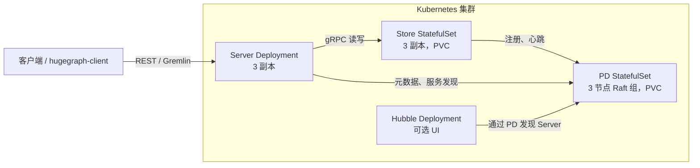

### 1 概述

Helm chart 在 Kubernetes 上部署一套分布式 HugeGraph 集群：PD、Store、Server，以及可选的 Hubble UI。chart 位于主仓库的
[`helm/hugegraph`](https://github.com/apache/hugegraph/tree/master/helm/hugegraph) 目录。

| 组件 | 工作负载 | 默认副本数 | 作用 |
|------|----------|------------|------|
| PD | StatefulSet + PVC | 3 | 元数据管理：以 Raft 组跟踪 Store 与分区 |
| Store | StatefulSet + PVC | 3 | 图数据存储 (HStore) |
| Server | Deployment | 3 | Gremlin 与 REST 查询层 |
| Hubble | Deployment | 0（默认关闭） | Web UI，通过 `hubble.enabled=true` 启用 |

分布式 HugeGraph 集群有一套启动约定（Server 不执行 `init-store`、每个 Server 都通过 PD 读写图元数据、Store 等待 PD
形成多数派、一个 PD REST 密钥由三个组件共用）。chart 把这套约定固化下来，运维人员无需手工处理；细节见
[chart README](https://github.com/apache/hugegraph/tree/master/helm/hugegraph#chart-details)。日常运维（NetworkPolicy
细节、灾难恢复、伸缩、安全滚动 Store、在集群外运行 Hubble）见
[运维页](/cn/docs/quickstart/hugegraph/hugegraph-helm-operations/)。



启动顺序由 chart 保证，而不是由运维人员保证：PD 先选出 leader，每个 Store Pod 的 init 容器等到多数 PD 汇报就绪后才启动，
Server 则反复等待存储层，直到 Store 完成注册。全新安装无需手工干预即可收敛。

### 2 前置条件

- Kubernetes 1.23 及以上（chart 渲染 `autoscaling/v2` 和 `policy/v1`）
- Helm 3；升级一节提到的 `--reset-then-reuse-values` 需要 Helm 3.14 及以上
- 动态卷供给：有默认 StorageClass，或为 PD 和 Store 显式指定 `storageClassName`
- 默认拓扑要运行九个 JVM 进程，内存需留足；见安装一节的资源说明

chart 要求组件镜像包含 PD 就绪探测端点和 PD REST 认证（两者都已合入 1.7.0 之后的版本）。默认镜像 tag 指向的构建已包含
这些改动；1.7.0 镜像不受支持。

### 3 安装

#### 3.1 获取 chart

chart 尚未发布到 chart 仓库，从源码树安装：

```bash
git clone https://github.com/apache/hugegraph.git
cd hugegraph
```

#### 3.2 使用默认值安装

先确认 `kubectl` 指向目标集群，且集群能供给存储卷。因缺少 StorageClass 而卡在 `Pending` 的 PVC 是最常见的首次安装
故障：

```bash
kubectl config current-context
kubectl get storageclass
```

然后安装：

```bash
helm install hugegraph ./helm/hugegraph --namespace hugegraph --create-namespace --wait --timeout 15m
```

`--wait` 让 Helm 阻塞到所有工作负载就绪。对分布式集群来说，这个信号意味着 PD 已选出 leader、Store 已注册、Server 已
启动；不加它，`helm install` 在对象创建完成后就返回。全新集群一般几分钟内收敛，15 分钟超时是给缓慢的镜像拉取留的余量。

继续之前需要了解两个默认值：

- **默认不设置 resources。** 每个 Pod 都是 BestEffort，JVM 按节点总内存计算堆大小。单节点没有问题；多节点集群上各个堆
  会超订节点内存导致进程中止。超出笔记本范围的部署请使用 `values-cluster.yaml`，或按组件设置 `resources`。
- **镜像 tag 跟踪 `latest`**，且 `pullPolicy: Always`，直到下一个 HugeGraph 版本发布。生产环境请固定 tag 或 digest。

#### 3.3 拓扑预设

chart 附带三个 values 文件：

| 文件 | 拓扑 | 适用场景 |
|------|------|----------|
| `values.yaml` | 3 PD + 3 Store + 3 Server | 默认；preferred 反亲和，认证开启，Hubble 关闭 |
| `values-single.yaml` | 1 + 1 + 1 | 单节点开发与 CI；PVC 更小 |
| `values-cluster.yaml` | 3 + 3 + 3 | 生产起点：JVM 堆与资源设置、PD/Store PodDisruptionBudget、`required` 反亲和、NetworkPolicy 开启 |

```bash
helm install hugegraph ./helm/hugegraph --namespace hugegraph --create-namespace \
    -f helm/hugegraph/values-single.yaml --wait --timeout 15m
```

`values-cluster.yaml` 是起点而非容量保证：请按图规模和流量重新核算资源。其中一个数字值得说明：它给每个 Store 申请
5Gi、限制 8Gi 内存，远高于 1Gi 的堆，因为 Store 的 RocksDB 缓存在 JVM 堆之外（4Gi 的限制在约 1 GB 数据后就把
Store OOM 杀掉了）。两个数字要随数据量一起放大。完整参数参考（每个组件的探针、调度、Secret 配置项）见
[chart README](https://github.com/apache/hugegraph/tree/master/helm/hugegraph#configuration)。

#### 3.4 验证安装

```bash
helm test hugegraph --namespace hugegraph
```

读取自动生成的 admin 密码并调用 API：

```bash
PASSWORD="$(kubectl get secret -n hugegraph hugegraph-admin -o jsonpath='{.data.password}' | base64 --decode)"
kubectl port-forward -n hugegraph svc/hugegraph-server 8080:8080
curl --user "admin:${PASSWORD}" http://127.0.0.1:8080/versions
```

以上命令假定 release 名为 `hugegraph`；用其他名字时，请替换成带 release 前缀的资源名（`kubectl get svc,secret -n
<namespace>` 可以列出）。`helm install` 结束时打印的说明里包含填好名字的同样命令。

### 4 认证与 Secret

认证默认开启，chart 管理三个 Secret。每个凭据按同一顺序取值：你预先创建的 `existingSecret` 优先，其次是内联值，最后
是安装时随机生成。

| Secret | 键 | 用途 | 自带凭据的配置项 |
|--------|-----|------|------------------|
| `<release>-admin` | `password` | Server admin 账号、Hubble 登录 | `server.auth.admin.existingSecret` |
| `<release>-auth-token` | `token_secret` | 所有 Server 副本共用的 JWT 签名密钥 | `server.auth.token.existingSecret` |
| `<release>-pd-auth` | `secret-key` | PD REST 认证，由 PD、Server、Hubble 读取 | `pd.auth.existingSecret` |

要自行管理凭据，请在安装前创建 Secret 并把对应的 `existingSecret` 指向它；chart 不会改动任何不是它创建的 Secret。取值
约束：admin 密码不能包含换行、回车或反斜杠；JWT 密钥至少 32 字节；PD 密钥必须是可打印 ASCII。非法值会在渲染时或启动
包装脚本中被拒绝，不会被悄悄截断。

chart 管理的 Secret 在卸载时保留，同名 release 再次安装会复用它们。

<details>
<summary>轮换与注意事项</summary>

- admin 密码只在认证元数据首次创建时生效，之后修改 Secret 不会轮换已有集群的密码。请改用 Server 的 auth API 轮换。
- 轮换 PD REST Secret 会在下一次 `helm upgrade` 时同时滚动 PD、Server 和 Hubble，保证三者持有的副本一致。纯模板流水线
  （`helm template`、GitOps 渲染器）看不到集群里的 Secret，因此在那里检测轮换的注解不起作用。
- 三个 Secret 即使从不读取也都存在：安装结束打印的说明里有读取 admin 密码和 PD 密钥的 `kubectl get secret` 命令。
</details>

### 5 健康检查与启动顺序

PD 暴露两个健康端点，chart 有意同时使用两者：

- `/v1/health` 在 REST 监听建立后立刻返回 200。它不查询 Raft，因此感知不到多数派丢失。
- `/v1/ready` 在 PD Raft 组选出 leader 之前返回 503，反映的是多数派状态而不只是进程存活。

chart 把 PD 的**就绪探测**和 Store init 容器的等待放在 `/v1/ready` 上：Store 只有在多数 PD 成为多数派成员后才启动，
失去 leader 的 PD 会退出 Service 端点，直到 leader 恢复。PD 的**启动和存活探测**按副本数推导（`pd.livenessPath`
可覆盖）。多副本时特意留在 `/v1/health` 上：只是失去 leader 的 PD 仍是健康的 Raft 成员，重启它只会让故障恶化。
单副本 PD 是例外，推导为 `/v1/ready`：它没有选举可失去，而一个永久退位的 PD（例如磁盘写满导致 Raft 快照失败之后，
[apache/hugegraph#3222](https://github.com/apache/hugegraph/issues/3222)）会一直用 `/v1/health` 返回 200 却不再
服务写入；改用 `/v1/ready` 让 kubelet 把它重启。

Server 的启动获得相同的预算：镜像默认会在 120 秒后杀掉仍在启动的 Server，chart 因此从启动探针推导
`HG_SERVER_STARTUP_TIMEOUT_S`（默认 450 秒），配置的探针预算低于该下限时会被抬高。如果存储层启动更慢，调大
`server.probes.startup`，镜像的预算会跟着变。

### 6 启用 Hubble UI

Hubble 默认关闭，纯 API 集群因此更精简。在运行中的 release 上启用：

```bash
helm upgrade hugegraph ./helm/hugegraph --namespace hugegraph --reuse-values --set hubble.enabled=true
```

```bash
kubectl port-forward -n hugegraph svc/hugegraph-hubble 8088:8088
```

打开 `http://127.0.0.1:8088`，用 3.4 节的 admin 密码以 `admin` 身份登录。Hubble 通过 PD 发现 Server，集群运维视图无需
额外配置即可工作。Hubble 只提供明文 HTTP：请通过 port-forward 或做 HTTPS 终结的 Ingress 访问，绝不要直接暴露在不可信
网络上。在集群外运行 Hubble 也可行，但配置更多；见 chart README 的
[Reaching Hubble](https://github.com/apache/hugegraph/tree/master/helm/hugegraph#reaching-hubble-pick-one-path)。

### 7 升级

```bash
helm upgrade hugegraph ./helm/hugegraph --namespace hugegraph --reuse-values
```

`--reuse-values` 保留 release 的既有覆盖值；不加它，升级会以 chart 默认值重建 release。任何改变 Pod 模板的升级都会让
对应工作负载滚动一次。需要提前规划的几点：

- **全新安装后的第一次升级会让 PD、Server、Hubble 各滚动一次**，因为跟踪 Secret 的注解第一次观察到安装时创建的
  Secret。Store 不受影响。
- **Store 的滚动更新以监听检查推进，而不是以分片恢复推进**，因此控制器可能在上一个 Store 尚未重新加入分片组时就替换
  下一个。生产环境滚动镜像时，设置 `store.updateStrategy.type=OnDelete`，逐个替换 Store Pod。PD 里的 `Up` 不是两次
  替换之间的检查：PD 在注册时就把 Store 标为 `Up`，此时分区尚未恢复，已停止的 Store 也要等 300 秒 keep-alive 过期
  才离开 `Up`。应等被替换的 Pod 变为 `Ready`，再确认每个分片组都报告完整分片数和一个 leader；完整流程见
  [运维页](/cn/docs/quickstart/hugegraph/hugegraph-helm-operations/)。PD 本来就逐个重启，
  `pd.updateStrategy.type=OnDelete` 为维护窗口提供同样的手工控制。
- **升级不能修改 PVC 大小**：Kubernetes 禁止修改 StatefulSet 的 `volumeClaimTemplates`，带新 `storage.size` 的升级会
  被整体拒绝。chart README 记录了支持卷扩容的 StorageClass 上的扩容步骤。

Server 的扩缩容是普通的 values 变更（`server.replicas` 或 `server.hpa`）。**缩容 PD 或 Store 不是**：Raft 与分片成员
关系是持久化的，删除 Pod 不会重新配置它们，PD 从 3 缩到 1 会永久失去多数派。chart 会拒绝副本数低于线上 StatefulSet
的升级；先迁移再缩容的手工步骤见 chart README 的
[Scaling](https://github.com/apache/hugegraph/tree/master/helm/hugegraph#scaling)。

### 8 卸载

```bash
helm uninstall hugegraph --namespace hugegraph
```

有两类状态是有意保留的。StatefulSet 创建的 PersistentVolumeClaim 会保留（Kubernetes 行为），确认数据不再需要后请显式
删除。chart 管理的 Secret 也会保留，同名 release 再次安装时凭据不变。

### 9 限制

- `networkPolicy.enabled` 为每个组件渲染只放行本 release 流量的 NetworkPolicy；默认关闭，`values-cluster.yaml`
  中开启。它之所以重要，是因为 chart 在集群内关闭了 PD 的 Raft IP 白名单（Pod IP 会变化；白名单只在启动时解析一次
  对端，之后就会拦截它们），raft 与 gRPC 端口的访问限制由这些策略承担。策略需要强制执行 NetworkPolicy 的网络插件
  （Calico、Cilium、kind v0.25 及以上、k3s），所有外部调用方（包括 Ingress 控制器）都必须列入
  `networkPolicy.<component>.extraIngress`，否则渲染失败。细节见
  [运维页](/cn/docs/quickstart/hugegraph/hugegraph-helm-operations/)。
- 镜像 tag 跟踪 `latest`，直到下一个 HugeGraph 版本发布带版本号的镜像；长期运行的环境请固定 tag 或 digest。
- 创建图之后，其他 Server 副本在短暂窗口内可能尚未收敛，路由到这类副本的查询可能报 `Could not rebind [g]` 之类的
  错误。请带退避重试，或对"创建后立即查询"的流程使用会话粘滞路由；集群级图就绪在
  [#3137](https://github.com/apache/hugegraph/issues/3137) 跟踪。
- 当前版本的 Store 恢复由运维人员触发：Store 丢失后的副本重建、leader 均衡、分区再均衡都只在调用 PD 的 REST API 时
  执行。丢失了卷的 Store 只有在携带
  [apache/hugegraph#3234](https://github.com/apache/hugegraph/pull/3234)（2026-09-24 合入，尚未进入任何发布版本）
  的镜像上才能原地恢复；更早的镜像上，替换 Store Pod 时请保留它的 PVC。操作手册见
  [运维页](/cn/docs/quickstart/hugegraph/hugegraph-helm-operations/)的灾难恢复一节。
- 集群内无 TLS 终结，无备份工具，无 Operator，无内置监控栈。

### 10 排障

| 现象 | 先查什么 |
|------|----------|
| Store Pod 卡在 `Init:0/1` | PD 未就绪：`kubectl logs <store-pod> -c wait-for-pd`，再看 PD Pod |
| PVC 停在 `Pending` | 没有默认 StorageClass，或供给器故障：`kubectl get sc` |
| 多节点上 Pod 被 OOM 杀掉或反复重启 | 未设置 resources，JVM 按节点内存取堆：用 `values-cluster.yaml` |
| 建图后立刻查询失败 | 副本收敛窗口：见上文"限制" |

每种情况的完整排查步骤见
[chart README](https://github.com/apache/hugegraph/tree/master/helm/hugegraph#troubleshooting)。
