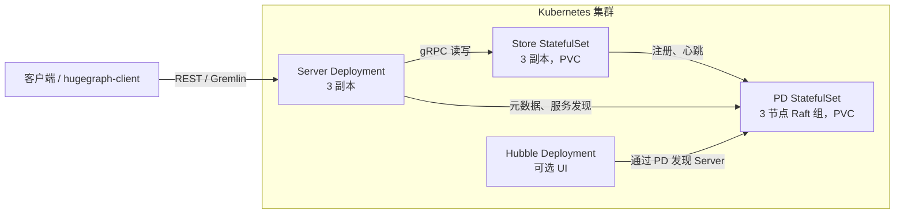

### 1 概述

Helm chart 在 Kubernetes 上部署一套分布式 HugeGraph 集群：PD、Store、Server，以及可选的 Hubble UI。chart 位于主仓库的
[`helm/hugegraph`](https://github.com/apache/hugegraph/tree/master/helm/hugegraph) 目录。

| 组件 | 工作负载 | 默认副本数 | 作用 |
|------|----------|------------|------|
| PD | StatefulSet + PVC | 3 | 元数据管理：以 Raft 组跟踪 Store 与分区 |
| Store | StatefulSet + PVC | 3 | 图数据存储 (HStore) |
| Server | Deployment | 3 | Gremlin 与 REST 查询层 |
| Hubble | Deployment | 0（默认关闭） | Web UI，通过 `hubble.enabled=true` 启用 |

分布式 HugeGraph 集群有一套启动约定（Server 不执行 `init-store`、每个 Server 都通过 PD 读写图元数据、Store 等待 PD
形成多数派、一个 PD REST 密钥由三个组件共用）。chart 把这套约定固化下来，运维人员无需手工处理；细节见
[chart README](https://github.com/apache/hugegraph/tree/master/helm/hugegraph#chart-details)。日常运维（NetworkPolicy
细节、灾难恢复、伸缩、安全滚动 Store、在集群外运行 Hubble）见
[运维页](/cn/docs/quickstart/hugegraph/hugegraph-helm-operations/)。


```mermaid
flowchart LR
    subgraph Kubernetes 集群
        PD[PD StatefulSet<br>3 节点 Raft 组，PVC]
        Store[Store StatefulSet<br>3 副本，PVC] -->|注册、心跳| PD
        Server[Server Deployment<br>3 副本] -->|元数据、服务发现| PD
        Server -->|gRPC 读写| Store
        Hubble[Hubble Deployment<br>可选 UI] -->|通过 PD 发现 Server| PD
    end
    Client[客户端 / hugegraph-client] -->|REST / Gremlin| Server
```

启动顺序由 chart 保证，而不是由运维人员保证：PD 先选出 leader，每个 Store Pod 的 init 容器等到多数 PD 汇报就绪后才启动，
Server 则反复等待存储层，直到 Store 完成注册。全新安装无需手工干预即可收敛。

### 2 前置条件

- Kubernetes 1.23 及以上（chart 渲染 `autoscaling/v2` 和 `policy/v1`）
- Helm 3；升级一节提到的 `--reset-then-reuse-values` 需要 Helm 3.14 及以上
- 动态卷供给：有默认 StorageClass，或为 PD 和 Store 显式指定 `storageClassName`
- 默认拓扑要运行九个 JVM 进程，内存需留足；见安装一节的资源说明

chart 要求组件镜像包含 PD 就绪探测端点和 PD REST 认证（两者都已合入 1.7.0 之后的版本）。默认镜像 tag 指向的构建已包含
这些改动；1.7.0 镜像不受支持。

### 3 安装

#### 3.1 获取 chart

chart 尚未发布到 chart 仓库，从源码树安装：

```bash
git clone https://github.com/apache/hugegraph.git
cd hugegraph
```

#### 3.2 使用默认值安装

先确认 `kubectl` 指向目标集群，且集群能供给存储卷。因缺少 StorageClass 而卡在 `Pending` 的 PVC 是最常见的首次安装
故障：

```bash
kubectl config current-context
kubectl get storageclass
```

然后安装：

```bash
helm install hugegraph ./helm/hugegraph --namespace hugegraph --create-namespace --wait --timeout 15m
```

`--wait` 让 Helm 阻塞到所有工作负载就绪。对分布式集群来说，这个信号意味着 PD 已选出 leader、Store 已注册、Server 已
启动；不加它，`helm install` 在对象创建完成后就返回。全新集群一般几分钟内收敛，15 分钟超时是给缓慢的镜像拉取留的余量。

继续之前需要了解两个默认值：

- **默认不设置 resources。** 每个 Pod 都是 BestEffort，每个 JVM 在启动时把堆上限设为它看到的节点空闲内存的一半（各组件另有上限），
  因此同一节点上的几个 JVM 合起来可能占用超过节点总量的内存。单节点上的 `values-single.yaml` 也是如此。每次安装都请
  按组件设置 `resources`，单节点预设也不例外；`values-cluster.yaml` 为多节点集群设置了这些值。
- **镜像 tag 跟踪 `latest`**，且 `pullPolicy: Always`，直到下一个 HugeGraph 版本发布。生产环境请固定 tag 或 digest。

#### 3.3 拓扑预设

chart 附带三个 values 文件：

| 文件 | 拓扑 | 适用场景 |
|------|------|----------|
| `values.yaml` | 3 PD + 3 Store + 3 Server | 默认；preferred 反亲和，认证开启，Hubble 关闭 |
| `values-single.yaml` | 1 + 1 + 1 | 单节点开发与 CI；PVC 更小 |
| `values-cluster.yaml` | 3 + 3 + 3 | 生产起点：JVM 堆与资源设置、Server PodDisruptionBudget、`required` 反亲和、NetworkPolicy 开启、Store 使用 `OnDelete` 更新 |

```bash
helm install hugegraph ./helm/hugegraph --namespace hugegraph --create-namespace \
    -f helm/hugegraph/values-single.yaml --wait --timeout 15m
```

`values-cluster.yaml` 是起点而非容量保证：请按图规模和流量重新核算资源。其中一个数字值得说明：它给每个 Store 申请
5Gi、限制 8Gi 内存，远高于 1Gi 的堆，因为 Store 的 RocksDB 缓存在 JVM 堆之外（4Gi 的限制在约 1 GB 数据后就把
Store OOM 杀掉了）。两个数字要随数据量一起放大。完整参数参考（每个组件的探针、调度、Secret 配置项）见
[chart README](https://github.com/apache/hugegraph/tree/master/helm/hugegraph#configuration)。

#### 3.4 验证安装

```bash
helm test hugegraph --namespace hugegraph
```

测试先经 Server Service 调用 `/versions` 和 `/graphs`，再解析 headless Service `hugegraph-server-headless`，向它列出的
每个 Server Pod 发送一条带认证、绑定 `DEFAULT-hugegraph` 图的 Gremlin 查询，并要求至少有 `server.replicas` 个 Pod
（开启 HPA 时为 `server.hpa.minReplicas`）。headless Service 只列出 Ready 的 Pod，也就是 Server Service 实际转发流量的
那些 Pod，未 Ready 的 Pod 不会被查询。失败的 Pod 每 5 秒重试一次，最多 150 秒，短暂的 PD 选举因此不会被误判为 Pod
损坏；超时后测试失败，并打印每个失败 Pod 的 IP 和 HTTP 状态码。能通过就绪探测、能提供 REST、但每个 Gremlin 调用都
失败的 Server，正是靠这一步发现的（见"限制"）。HPA 规模较大时，`helm test --timeout` 可能需要高于默认的 5 分钟。

调用 API 前，先在一个终端里启动 port-forward；它会一直在前台运行，直到你停止它：

```bash
kubectl port-forward -n hugegraph svc/hugegraph-server 8080:8080
```

然后在第二个终端里读取自动生成的 admin 密码并调用 API：

```bash
PASSWORD="$(kubectl get secret -n hugegraph hugegraph-admin -o jsonpath='{.data.password}' | base64 --decode)"
curl --user "admin:${PASSWORD}" http://127.0.0.1:8080/versions
```

以上命令假定 release 名为 `hugegraph`；用其他名字时，请替换成带 release 前缀的资源名（`kubectl get svc,secret -n
<namespace>` 可以列出）。`helm install` 结束时打印的说明里包含填好名字的同样命令。

### 4 认证与 Secret

认证默认开启，chart 管理三个 Secret。每个凭据按同一顺序取值：你预先创建的 `existingSecret` 优先，其次是内联值，最后
是安装时随机生成。

| Secret | 键 | 用途 | 自带凭据的配置项 |
|--------|-----|------|------------------|
| `<release>-admin` | `password` | Server admin 账号、Hubble 登录 | `server.auth.admin.existingSecret` |
| `<release>-auth-token` | `token_secret` | 所有 Server 副本共用的 JWT 签名密钥 | `server.auth.token.existingSecret` |
| `<release>-pd-auth` | `secret-key` | PD REST 认证，由 PD、Server、Hubble 读取 | `pd.auth.existingSecret` |

要自行管理凭据，请在安装前创建 Secret 并把对应的 `existingSecret` 指向它；chart 不会改动任何不是它创建的 Secret。取值
约束：admin 密码必须是不含空格、冒号和反斜杠的可打印 ASCII（镜像会在空格前写入反斜杠，Server 又按每个冒号拆分
Basic 认证凭据，两者都会让账号无法用 Secret 中的值登录）；JWT 密钥至少 32 字节；PD 密钥必须是不含反斜杠、
首尾没有空格的可打印 ASCII。非法的内联值在渲染时被拒绝，`existingSecret` 的值在 Pod 启动时被启动包装脚本拒绝，
不会被悄悄截断。

chart 管理的 Secret 在卸载时保留，同名 release 再次安装会复用它们。

<details>
<summary>轮换与注意事项</summary>

- admin 密码只在认证元数据首次创建时生效，之后修改 Secret 不会轮换已有集群的密码。请改用 Server 的 auth API 轮换。
- 轮换凭据会在下一次 `helm upgrade` 时让读取它的 Pod 滚动一次：PD REST Secret 同时滚动 PD、Server 和 Hubble，保证三者
  持有的副本一致；admin 密码或 JWT 密钥只滚动 Server。
- 纯模板流水线（`helm template`、Argo CD、模板模式的 Flux）看不到集群里的 Secret，因此 chart 生成的凭据每次渲染都会得到
  新值：每次同步都会改动 Secret、滚动读取它的 Pod，并让首次启动时创建的 admin 账号与 Secret 不再一致。这类流水线请先
  创建三个 Secret 并设置对应的 `existingSecret`；见 chart README 的
  [Template-only pipelines](https://github.com/apache/hugegraph/tree/master/helm/hugegraph#template-only-pipelines-gitops)。
- 三个 Secret 即使从不读取也都存在：安装结束打印的说明里有读取 admin 密码和 PD 密钥的 `kubectl get secret` 命令。
</details>

### 5 健康检查与启动顺序

PD 暴露两个健康端点，chart 有意同时使用两者：

- `/v1/health` 在 REST 监听建立后立刻返回 200。它不查询 Raft，因此感知不到多数派丢失。
- `/v1/ready` 在 PD Raft 组选出 leader 之前返回 503，反映的是多数派状态而不只是进程存活。

chart 把 PD 的**就绪探测**和 Store init 容器的等待放在 `/v1/ready` 上：Store 只有在多数 PD 成为多数派成员后才启动，
失去 leader 的 PD 会退出 Service 端点，直到 leader 恢复。PD 的**启动和存活探测**按副本数推导（`pd.livenessPath`
可覆盖）。多副本时特意留在 `/v1/health` 上：只是失去 leader 的 PD 仍是健康的 Raft 成员，重启它只会让故障恶化。
单副本 PD 是例外，推导为 `/v1/ready`：它没有选举可失去，而一个永久退位的 PD（例如磁盘写满导致 Raft 快照失败之后，
[apache/hugegraph#3222](https://github.com/apache/hugegraph/issues/3222)）会一直用 `/v1/health` 返回 200 却不再
服务写入；改用 `/v1/ready` 让 kubelet 把它重启。

Server 启动获得至少 450 秒的预算，足够覆盖镜像入口脚本在启动命令之前执行的 300 秒存储等待和进程启动。chart 按
`(failureThreshold - 1) * periodSeconds` 计算有保证的探测时间，因为 kubelet 可能在容器启动后立刻执行第一次探测；
配置的 `failureThreshold` 低于该下限时会被抬高（默认 5 秒周期下为 91，也就是默认值）。镜像默认会在 120 秒后杀掉
仍在启动的 Server，chart 因此把 `HG_SERVER_STARTUP_TIMEOUT_S` 设为有保证的探测时间减去 300 秒存储等待：默认 150 秒，
不低于镜像的 120 秒。这样启动命令与探针同时放弃。如果存储层启动更慢，调大 `server.probes.startup`，超时会跟着变；
该变量由 chart 管理，请修改探针，不要在 `server.extraEnv` 里设置它。

### 6 启用 Hubble UI

Hubble 默认关闭，纯 API 集群因此更精简。在运行中的 release 上启用：

```bash
helm upgrade hugegraph ./helm/hugegraph --namespace hugegraph --reuse-values --set hubble.enabled=true
```

```bash
kubectl port-forward -n hugegraph svc/hugegraph-hubble 8088:8088
```

打开 `http://127.0.0.1:8088`，用 3.4 节的 admin 密码以 `admin` 身份登录。Hubble 通过 PD 发现 Server，集群运维视图无需
额外配置即可工作。Hubble 只提供明文 HTTP：请通过 port-forward 或做 HTTPS 终结的 Ingress 访问，绝不要直接暴露在不可信
网络上；NodePort 或 LoadBalancer 类型的 Hubble Service 需要设置 `hubble.service.allowInsecureExposure=true` 确认后才会
渲染。在集群外运行 Hubble 也可行，但配置更多；见 chart README 的
[Reaching Hubble](https://github.com/apache/hugegraph/tree/master/helm/hugegraph#reaching-hubble-pick-one-path)。

### 7 升级

```bash
helm upgrade hugegraph ./helm/hugegraph --namespace hugegraph --reuse-values
```

`--reuse-values` 保留 release 的既有覆盖值；不加它，升级会以 chart 默认值重建 release。它还会把旧 values 当作完整的基准，
因此由早期 chart 版本创建的 release 不会获得新的默认值（例如加固后的 `securityContext`）；要采用它们，请用 `-f` 传入
自己的 values，或使用 `--reset-then-reuse-values`。任何改变 Pod 模板的升级都会让
对应工作负载滚动一次。需要提前规划的几点：

- **没有变更的升级不会滚动任何工作负载。** 跟踪 Secret 的注解对每个凭据的值做哈希（`existingSecret` 则取其线上
  `resourceVersion`），只有 Pod 读取的凭据变化时它才会滚动。确实同时滚动 PD 和 Server 的升级（例如轮换 PD REST Secret，
  或同时更换两者的镜像）可能让 Server 丢失 Gremlin 绑定（见"限制"），因此任何同时滚动了 PD 和 Server 的升级之后，
  请运行 `helm test`。
- **Store 的滚动更新以监听检查推进，而不是以分片恢复推进**，因此控制器可能在上一个 Store 尚未重新加入分片组时就替换
  下一个。`values-cluster.yaml` 因此设置了 `store.updateStrategy.type=OnDelete`；`values.yaml` 和 `values-single.yaml`
  仍为 `RollingUpdate`，其他生产 values 请自行设置。`OnDelete` 下升级只更新 StatefulSet，不替换任何 Store Pod，由你逐个
  删除 Store Pod。`OnDelete` 只是停止自动推进：删除 Pod 时不在两次删除之间做检查，风险相同。PD 里的 `Up` 不是这个检查：
  PD 在注册时就把 Store 标为 `Up`，此时分区尚未恢复，已停止的 Store 也要等 300 秒 keep-alive 过期才离开 `Up`。当前
  镜像上没有任何端点报告 Store 已完成分区恢复（[apache/hugegraph#3229](https://github.com/apache/hugegraph/issues/3229)），
  因此只能间接检查。应等被替换的 Pod 变为 `Ready`，再确认每个分片组都报告完整分片数和一个 leader；完整流程见
  [运维页](/cn/docs/quickstart/hugegraph/hugegraph-helm-operations/#6-安全地滚动-store-镜像)。
- **控制器每次最多滚动一个 PD 或 Store Pod。** chart 不设置 `updateStrategy.rollingUpdate.maxUnavailable`，且该字段只接受
  整数 `1`：更大的数字或百分比会导致渲染失败，因为它会让控制器同时停掉三成员 Raft 组或分片中的两个成员，而
  PodDisruptionBudget 不约束控制器发起的滚动。PD 的维护窗口可用 `pd.updateStrategy.type=OnDelete` 获得与 Store 相同的
  手工控制。
- **升级不能修改 PVC 大小**：Kubernetes 禁止修改 StatefulSet 的 `volumeClaimTemplates`，带新 `storage.size` 的升级会
  被整体拒绝。chart README 记录了支持卷扩容的 StorageClass 上的扩容步骤。
- **部分值在 release 初始化后就固定。** `nameOverride`、`fullnameOverride`、PD 与 Store 的 raft 端口以及存储设置属于
  安装时身份：chart 会对照线上 StatefulSet 拒绝修改 override 或 raft 端口，Kubernetes 拒绝修改存储设置。
  `server.auth.admin.*` 和分区分片数只在初始化时生效，已初始化的集群会忽略新值。chart README 按
  [生命周期](https://github.com/apache/hugegraph/tree/master/helm/hugegraph#settings-by-lifecycle)对各个值分了类。
- **`helm rollback` 不运行 chart 的任何检查。** 回滚（包括 `--atomic` 升级失败后的自动回滚）直接重新应用之前保存的
  清单，不渲染 chart，因此跨越 PD 或 Store 副本数变更的回滚会把 StatefulSet 直接缩放到旧数量，可能让 PD 失去多数派。
  不支持跨越成员关系或身份变更的回滚：要回到更早的 chart 或镜像，请用保留当前拓扑 values 的正向升级，且改变副本数的
  升级不要加 `--atomic`。任何回滚之后要做的检查见 chart README 的
  [Rollback](https://github.com/apache/hugegraph/tree/master/helm/hugegraph#rollback)。

Server 的扩缩容是普通的 values 变更（`server.replicas` 或 `server.hpa`）。**双向改变 PD 数量、或缩容 Store 都不是**：
Raft 与分片成员关系是持久化的，Pod 本身不会重新配置它们，因此 PD 从 3 缩到 1 会永久失去多数派，新增的
PD Pod 也不会加入投票配置。chart 读取线上 StatefulSet，拒绝改变 PD 数量或降低 Store 数量的升级；手工步骤见
[运维页](/cn/docs/quickstart/hugegraph/hugegraph-helm-operations/#8-伸缩)。

### 8 卸载

```bash
helm uninstall hugegraph --namespace hugegraph
```

有两类状态是有意保留的。StatefulSet 创建的 PersistentVolumeClaim 会保留（Kubernetes 行为），确认数据不再需要后请显式
删除。chart 管理的 Secret 也会保留，同名 release 再次安装时凭据不变。

### 9 限制

- `networkPolicy.enabled` 为每个组件渲染只放行本 release 流量的 NetworkPolicy；默认关闭，`values-cluster.yaml`
  中开启。它之所以重要，是因为 chart 在集群内关闭了 PD 的 Raft IP 白名单（Pod IP 会变化；白名单只在启动时解析一次
  对端，之后就会拦截它们），raft 与 gRPC 端口的访问限制由这些策略承担。策略需要强制执行 NetworkPolicy 的网络插件
  （Calico、Cilium、kind v0.25 及以上、k3s），所有外部调用方（包括 Ingress 控制器）都必须列入
  `networkPolicy.<component>.extraIngress`，否则渲染失败。细节见
  [运维页](/cn/docs/quickstart/hugegraph/hugegraph-helm-operations/)。
- 镜像 tag 跟踪 `latest`，直到下一个 HugeGraph 版本发布带版本号的镜像；长期运行的环境请固定 tag 或 digest。
- 创建图之后，其他 Server 副本在短暂窗口内可能尚未收敛，路由到这类副本的查询可能报 `Could not rebind [g]` 之类的
  错误。请带退避重试，或对"创建后立即查询"的流程使用会话粘滞路由；集群级图就绪在
  [#3137](https://github.com/apache/hugegraph/issues/3137) 跟踪。
- 在 PD 不可达时（例如 PD 滚动期间）启动的 Server，可能在整个 Pod 生命周期内都没有 Gremlin 绑定：它通过就绪探测、
  正常提供 REST，而每个发到它的 Gremlin 请求都报 `Could not rebind [graph]`
  （[apache/hugegraph#3228](https://github.com/apache/hugegraph/issues/3228)）。就绪探测调用的是 `/versions`，看不到
  这种状态。`helm test` 会在每个 Ready 的 Server Pod 上查询 Gremlin，并打印处于这种状态的 Pod 的 IP；删除该 Pod，PD 稳定后
  替换者会正常绑定。见
  [Gremlin 报 "Could not rebind" 时](/cn/docs/quickstart/hugegraph/hugegraph-helm-operations/#10-gremlin-报-could-not-rebind-时)。
- 启动时打不开自己 RocksDB 存储的 PD（例如另一个进程仍持有存储的 `LOCK` 文件）既不重试也不退出：它只记录一次
  `Failed to open RocksDB`，之后继续运行，`/v1/ready` 返回 503 和 `STATE_UNINITIALIZED`，而 `/v1/health` 返回 200。
  这是在 Kubernetes 之外的 PD 进程上观察到的（[apache/hugegraph#3226](https://github.com/apache/hugegraph/issues/3226)）。
  在 chart 的探针下，这样的 Pod 不会 Ready，并退出 Service 端点。多副本 PD 的启动和存活探测使用 `/v1/health`，kubelet
  不会重启它；单副本 PD 使用 `/v1/ready`，kubelet 会重启容器。这种状态在 Kubernetes 上如何出现，以及重启或删除 Pod
  能否消除它，都尚未测试。删除 `LOCK` 文件不是解决办法：它们保护存储不被可能仍在运行的另一个进程同时打开。
- 当前版本的 Store 恢复由运维人员触发：Store 丢失后的副本重建、leader 均衡、分区再均衡都只在调用 PD 的 REST API 时
  执行。丢失了卷的 Store 只有在携带
  [apache/hugegraph#3234](https://github.com/apache/hugegraph/pull/3234)（2026-09-24 合入，尚未进入任何发布版本）
  的镜像上才能原地恢复；更早的镜像上，替换 Store Pod 时请保留它的 PVC。操作手册见
  [运维页](/cn/docs/quickstart/hugegraph/hugegraph-helm-operations/)的灾难恢复一节。
- Server 和 Hubble 只提供明文 HTTP，PD gRPC 没有认证。它们中任何一个的 NodePort 或 LoadBalancer Service，都要设置对应的
  `pd.service.allowInsecureExposure`、`server.service.allowInsecureExposure` 或 `hubble.service.allowInsecureExposure`
  才会渲染；不带 `tls` 的 Server 或 Hubble Ingress 也要设置各自的 `allowPlainHttp`。优先使用 port-forward 或做 HTTPS
  终结的 Ingress，暴露 Service 前先限制谁能访问它。
- 集群内无 TLS 终结，无备份工具，无 Operator，无内置监控栈。

### 10 排障

| 现象 | 先查什么 |
|------|----------|
| Store Pod 卡在 `Init:0/1` | PD 未就绪：`kubectl logs <store-pod> -c wait-for-pd`，再看 PD Pod |
| PVC 停在 `Pending` | 没有默认 StorageClass，或供给器故障：`kubectl get sc` |
| Pod 被 OOM 杀掉或反复重启 | 未设置 resources，JVM 按节点内存取堆：设置 `resources`（见"安装"） |
| 建图后立刻查询失败 | 副本收敛窗口：见上文"限制" |
| `helm test` 打印 `Gremlin failed on <Pod IP>` | 该 Server Pod 丢失了 Gremlin 绑定：删除它（见上文"限制"） |
| 某个 PD Pod 一直不 Ready，其 `/v1/ready` 报 `STATE_UNINITIALIZED` | 它的 RocksDB 存储可能没有打开：在日志中查找 `Failed to open RocksDB`（见上文"限制"） |

其中多数情况的完整排查步骤见
[chart README](https://github.com/apache/hugegraph/tree/master/helm/hugegraph#troubleshooting)。
