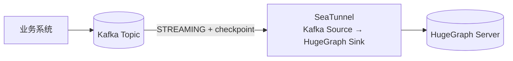
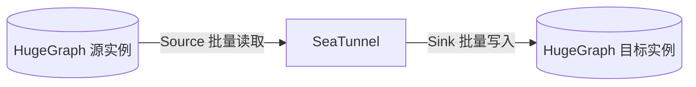

<!--
  TODO(apache/hugegraph-doc#464)：本文 SeaTunnel 官方文档链接暂指向 latest（无版本号）页面。
  2.3.13 及之前版本的参数以官网版本下拉里的 2.3.13 文档为准。
  HugeGraph Source Connector 尚未随正式版本发布，官网 latest 无对应页面，
  故 Source 文档链接暂指向 GitHub dev 分支文件。
  待 Source 随正式版本发布后，将链接切换为官网版本化地址，
  例如 https://seatunnel.apache.org/docs/2.3.14/connectors/source/HugeGraph/
-->

### 1 版本与兼容性

| 组件 | 版本要求 | 说明 |
|------|---------|------|
| Java | 11+ | HugeGraph Client 1.5.0+ 运行环境要求 |
| Apache SeaTunnel | 2.3.13+ | Sink 自 2.3.12 合入；2.3.13 起内置 HugeGraph Client 1.5.0 |
| HugeGraph Server | 1.5.0+ | 需与 Connector 内置 Client 版本匹配 |

> 配置 API 有两代，别混用：
>
> - **2.3.13 正式版**：Sink 只支持 `schema_config`（必填）。本文第 4 节和第 5.1 节的示例按它来写。
> - **next（dev）分支**：`mappings` 多映射、`schema_save_mode` 自动建 Schema、`data_save_mode` 等新选项，以及 **Source Connector** 都只在这里，正式版还没带。本文 5.3 节的图迁移是 dev 预览。
>
> next 分支内置的 HugeGraph Client 已升到 1.7.0，需搭配对应版本的 Server。

### 2 概述

[Apache SeaTunnel](https://seatunnel.apache.org/) 是开源数据集成平台，批处理、流式同步都支持，自带 100+ 连接器。HugeGraph 的 Connector-V2 已合入：Sink 负责写入（顶点/边的批量写入、更新、删除），Source 负责读取（批量读取、整图迁移，尚未发布）。


### 3 选型：SeaTunnel 还是 Loader

可以把 SeaTunnel 理解为 [Loader](/cn/docs/quickstart/toolchain/hugegraph-loader) + [Tools](/cn/docs/quickstart/toolchain/hugegraph-tools) 的合集。两者不冲突：Loader 只管 HugeGraph，开箱即用；SeaTunnel 面向所有数据系统。按场景选：

| 你的场景 | 推荐 | 理由 |
|---------|------|------|
| 一次性 / 定时把本地文件、HDFS、MySQL 等导入 HugeGraph | Loader | 免部署，映射文件即写即用 |
| 数据已在（或必须经过）Flink、Spark、Kafka 等大数据管道 | SeaTunnel | 复用现有管道，不引入第二套导入工具 |
| 实时流式导入、CDC 增量同步 | SeaTunnel | 原生流式作业 + checkpoint 断点恢复 |
| 只维护 HugeGraph 一张图，规模可控、追求简单 | Loader | 工具链内闭环，无额外集群 |

选 SeaTunnel 要接受两点：部署一套 SeaTunnel 集群（或复用现有的），作业用通用 HOCON 配置，而不是 HugeGraph 映射文件。

### 4 快速开始

前置条件：HugeGraph Server 1.5.0+（[部署指南](/cn/docs/quickstart/hugegraph/hugegraph-server)）。

#### 4.1 部署 SeaTunnel

**Docker（推荐）**。注意两点：官方 `apache/seatunnel:2.3.13` 镜像只内置 fake/console 两个连接器（[官方说明](https://seatunnel.apache.org/docs/getting-started/docker/)），且基础镜像是 JDK8；本文示例需要 LocalFile、HugeGraph 连接器和 Java 11。所以官方镜像不能直接跑本文作业，二选一：

- 基于 JDK11 自建镜像并装好插件（示意，细节以官方 [自建镜像文档](https://seatunnel.apache.org/docs/getting-started/docker/) 为准）：

```dockerfile
FROM eclipse-temurin:11-jre
RUN curl -L -o /tmp/st.tgz https://downloads.apache.org/seatunnel/2.3.13/apache-seatunnel-2.3.13-bin.tar.gz \
    && tar -xzf /tmp/st.tgz -C /opt \
    && mv /opt/apache-seatunnel-2.3.13 /opt/seatunnel \
    && sh /opt/seatunnel/bin/install-plugin.sh 2.3.13 \
    && rm /tmp/st.tgz
WORKDIR /opt/seatunnel
```

```bash
docker build -t seatunnel-hg:2.3.13 .
```

- 或者直接用 4.1 末的二进制包方式跑（最省事）。

**Kubernetes**：生产集群用 Helm 部署，见官方 [K8s（Helm）部署文档](https://seatunnel.apache.org/docs/getting-started/kubernetes/helm/)。

**二进制包（参考）**：从 [下载页](https://seatunnel.apache.org/download/) 取安装包，解压后装插件、跑脚本。JVM 脚本方式仅作本地调试参考，生产优先 Docker / K8s：

```bash
sh bin/install-plugin.sh 2.3.13
sh bin/seatunnel.sh --config ./config/hugegraph-sync.conf -e local
```

部署细节以官方 [本地部署文档](https://seatunnel.apache.org/docs/getting-started/locally/deployment/) 为准。

#### 4.2 最小示例：CSV 文件 → person 顶点

先建 Schema：PropertyKey `name`（Text）、`age`（Int），VertexLabel `person`（主键 `name`），边示例另需 EdgeLabel `knows`（属性 `since`）。2.3.13 的 Sink 不会自动建 Schema，可在 Hubble 里建，或用服务端 REST/Gremlin 建。

准备一个无表头的 CSV（列顺序与 `schema.fields` 声明顺序一致），内容如下：

```csv
marko,29
vadas,27
josh,32
```

```hocon
env {
  job.mode = "BATCH"
}

source {
  LocalFile {
    path = "/data/person.csv"
    file_format_type = "csv"
    schema = {
      fields = {
        name = "string"
        age = "int"
      }
    }
  }
}

sink {
  HugeGraph {
    host = "127.0.0.1"
    port = 8080
    graph_name = "hugegraph"
    graph_space = "DEFAULT"
    # 以下为可选参数，默认值见第 6 节；认证开启时再填 username/password
    # protocol = "http"
    # username = "admin"
    # password = "admin"
    schema_config = {
      type = "VERTEX"
      label = "person"
      idStrategy = "PRIMARY_KEY"
      idFields = ["name"]
      properties = ["name", "age"]
    }
  }
}
```

一行 CSV 到图顶点的映射过程：

```text
┌───────────────── 输入行 (SeaTunnel Row) ─────────────────┐
│  name = "marko"        age = 29                          │
└──────────────────────────┬───────────────────────────────┘
                           │ schema_config:
                           │   type = VERTEX, label = person
                           │   idStrategy = PRIMARY_KEY, idFields = [name]
                           ▼
                 ┌───────────────────────────────┐
                 │ HugeGraph 顶点                 │
                 │ id   = person:marko           │
                 │ label = person                │
                 │ props = { name: "marko",      │
                 │           age: 29 }           │
                 └───────────────────────────────┘
```

#### 4.3 运行与验证

```bash
# 二进制方式（4.1 的自建镜像同理，把挂载和容器名换一下）
sh bin/seatunnel.sh --config ./config/hugegraph-sync.conf -e local
```

> **容器里跑要注意网络**：`127.0.0.1` 指向容器自身，连不到宿主机或另一个容器。
>
> - HugeGraph 跑在宿主机：把 `host` 改成 `host.docker.internal`，Linux 启动容器时加 `--add-host=host.docker.internal:host-gateway`；
> - HugeGraph 也在容器里：两个容器进同一个 docker 网络，`host` 填 HugeGraph 容器的容器名/服务名。

运行后，在 Hubble 或 REST API 里执行这条 Gremlin 验证：

```groovy
g.V().hasLabel('person').valueMap()
```

#### 4.4 写入边

关系行到边的映射同样用 `schema_config`，`sourceConfig` / `targetConfig` 还原边的两个端点，字段改名放在 `mapping.fieldMapping` 里。

<details>
<summary>展开查看：关系 CSV → knows 边 完整配置</summary>

CSV（无表头）：

```csv
marko,vadas,2020
marko,josh,2021
```

```hocon
env {
  job.mode = "BATCH"
}

source {
  LocalFile {
    path = "/data/knows.csv"
    file_format_type = "csv"
    schema = {
      fields = {
        person1_name = "string"
        person2_name = "string"
        since = "int"
      }
    }
  }
}

sink {
  HugeGraph {
    host = "127.0.0.1"
    port = 8080
    graph_name = "hugegraph"
    graph_space = "DEFAULT"
    schema_config = {
      type = "EDGE"
      label = "knows"
      sourceConfig = {
        label = "person"
        idFields = ["person1_name"]
      }
      targetConfig = {
        label = "person"
        idFields = ["person2_name"]
      }
      properties = ["since"]
      mapping = {
        fieldMapping = {
          person1_name = "name"
          person2_name = "name"
        }
      }
    }
  }
}
```

</details>

```text
person1_name = "marko"   person2_name = "vadas"   since = 2020
        │                        │
        ▼                        ▼
  sourceConfig             targetConfig
  label = person           label = person
  idFields = [person1_name] idFields = [person2_name]
        └───────────┬────────────┘
                    ▼
      edge: person:marko -[knows]-> person:vadas
      properties = { since: 2020 }
```

> 写边时端点顶点还不存在的话，默认行为可能产生孤儿边或幻影顶点（服务端行为）。不能接受就先导顶点、再导边；所用版本支持 `check_vertex` 时，开 `check_vertex = true` 可让服务端直接拒绝这类边（以所用版本的官方文档为准）。

### 5 常见场景

#### 5.1 Kafka 实时流导入



<details>
<summary>展开查看：Kafka → HugeGraph 流式作业配置（2.3.13）</summary>

```hocon
env {
  job.mode = "STREAMING"
  checkpoint.interval = 10000
}

source {
  Kafka {
    bootstrap.servers = "localhost:9092"
    topic = "user-events"
    consumer.group = "hugegraph-import"
    format = json
    schema = {
      fields = {
        name = "string"
        age = "int"
      }
    }
  }
}

sink {
  HugeGraph {
    host = "127.0.0.1"
    port = 8080
    graph_name = "hugegraph"
    graph_space = "DEFAULT"
    schema_config = {
      type = "VERTEX"
      label = "person"
      idStrategy = "PRIMARY_KEY"
      idFields = ["name"]
      properties = ["name", "age"]
    }
  }
}
```

</details>

> 要点：`job.mode = "STREAMING"` 加 `checkpoint.interval`，任务就能断点恢复。Sink 是 at-least-once 语义，`PRIMARY_KEY` / `CUSTOMIZE_*` 这类可还原的 ID 重放只是幂等更新。Kafka 参数是 `topic`（逗号分隔多 topic），offset、分区、format 等见 [Kafka Source 官方文档](https://seatunnel.apache.org/docs/connectors/source/Kafka/)。

#### 5.2 在 Flink / Spark 上运行

作业默认跑在 SeaTunnel 自带的 Zeta 引擎上。已有 Flink / Spark 集群的话，同一份配置换对应的 starter 脚本提交即可，内容不用改。脚本用法和版本支持见官方 [Flink 引擎文档](https://seatunnel.apache.org/docs/engines/flink/) 与 [Spark 引擎文档](https://seatunnel.apache.org/docs/engines/spark/)。

#### 5.3 HugeGraph → HugeGraph 图迁移（dev 预览）

2.3.13 没有 HugeGraph Source，本节需要 next（dev）构建（或等正式发布）；dev 同时支持 `mappings` 新配置。



<details>
<summary>展开查看：单图迁移（person 顶点，dev 构建）</summary>

```hocon
env {
  job.mode = "BATCH"
}

source {
  HugeGraph {
    host = "graph-a"
    port = 8080
    graph_name = "hugegraph"
    graph_space = "DEFAULT"
    label = "person"
    label_type = "VERTEX"
    schema = {
      fields = {
        name = "string"
        age = "int"
      }
    }
  }
}

sink {
  HugeGraph {
    host = "graph-b"
    port = 8080
    graph_name = "hugegraph"
    graph_space = "DEFAULT"
    mappings = [
      {
        type = "VERTEX"
        label = "person"
        idStrategy = "PRIMARY_KEY"
        idFields = ["name"]
        properties = ["name", "age"]
      }
    ]
  }
}
```

</details>

<details>
<summary>展开查看：批量迁移多个图的思路（示意，非可直接运行的配置）</summary>

A 实例有 3 个图，全部迁到 B 实例、图名不变时，按下面的思路组织，而不是复制粘贴下面这段伪代码：

1. **一次作业只迁一种元素**：Source 的 `label_type` 只能是 `VERTEX` 或 `EDGE` 之一，顶点、边各跑一次；先顶点、后边（边依赖端点）。
2. **省略 `label` 读全量**：Source 省略 `label` 会按 label 输出多张输入表；此时 sink 的 `mappings` 必须按每个 label 逐条写全，并按官方文档把每条映射绑定到对应输入表，否则会交叉写入。单 label 的 mappings 不能直接复用。
3. **多图用变量替换**：配置里写 `graph_name = "${graph}"`，提交时 `-i graph=xxx`（多个参数用逗号分隔，见官方 [命令文档](https://seatunnel.apache.org/docs/engines/zeta/user-command/)）。

```hocon
# 伪代码：结构示意，mappings 需按 label 逐条补全并绑定输入表
env {
  job.mode = "BATCH"
}

source {
  HugeGraph {
    host = "graph-a"
    port = 8080
    graph_name = "${graph}"
    graph_space = "DEFAULT"
    label_type = "VERTEX"
    # 不写 label：读取该图全部顶点 label；迁边时改成 "EDGE"
  }
}

sink {
  HugeGraph {
    host = "graph-b"
    port = 8080
    graph_name = "${graph}"
    graph_space = "DEFAULT"
    mappings = [ /* 按 label 逐条写，并绑定对应输入表 */ ]
  }
}
```

```bash
# 每张图：先跑 VERTEX 作业，再改 label_type 跑 EDGE 作业
for g in graph1 graph2 graph3; do
  sh bin/seatunnel.sh --config ./config/hugegraph-migrate.conf -e local -i graph=$g
done
```

</details>

> 克隆边时，Source 输出自带保留列 `~source_id` / `~target_id`，Sink 直接配 `sourceConfig.idFields = ["~source_id"]`、`targetConfig.idFields = ["~target_id"]` 就能复用，不用重新拼 ID。Source 还支持 `parallelism > 1` 分片并行，详见 [HugeGraph Source 文档](https://github.com/apache/seatunnel/blob/dev/docs/zh/connectors/source/HugeGraph.md)。

### 6 核心配置参数

以下为 2.3.13 版本 Sink 的常用参数；`mappings`、`schema_save_mode`、`data_save_mode` 等是 next（dev）分支新增（5.3 节用到 `mappings`），完整说明以官网对应版本文档为准：

| 参数 | 类型 | 必填 | 默认值 | 说明 |
|------|------|------|--------|------|
| `host` | String | 是 | - | HugeGraph Server 地址（只填主机名/IP，端口走 `port`） |
| `port` | Integer | 是 | - | HugeGraph Server 端口 |
| `graph_name` | String | 是 | - | 图名称 |
| `schema_config` | Object | 是 | - | 顶点/边映射（2.3.13 的配置方式） |
| `graph_space` | String | 否 | `DEFAULT` | 图空间 |
| `protocol` | String | 否 | `http` | 服务协议，支持 `http` / `https` |
| `username` | String | 否 | - | 认证用户名（服务端开启认证时必填） |
| `password` | String | 否 | - | 认证密码（服务端开启认证时必填） |
| `batch_size` | Integer | 否 | 500 | 单批写入前缓冲的记录数 |
| `batch_interval_ms` | Integer | 否 | 5000 | 刷新批次的最大等待时间（毫秒） |

`schema_config` 的常用字段：`type`（`VERTEX` / `EDGE`）、`label`、`properties`、`idStrategy` / `idFields`（顶点）、`sourceConfig` / `targetConfig`（边）、`mapping.fieldMapping`。其余字段见官方文档。

### 参考文档

- [Apache SeaTunnel 官方网站](https://seatunnel.apache.org/)
- [HugeGraph Sink Connector 官方文档](https://seatunnel.apache.org/docs/connectors/sink/HugeGraph/)（latest 展示 `mappings` 新 API，2.3.13 的 `schema_config` 版从官网版本下拉切换）
- [HugeGraph Source Connector 文档（dev 分支）](https://github.com/apache/seatunnel/blob/dev/docs/zh/connectors/source/HugeGraph.md)
- [SeaTunnel Docker 部署](https://seatunnel.apache.org/docs/getting-started/docker/)
- [SeaTunnel K8s（Helm）部署](https://seatunnel.apache.org/docs/getting-started/kubernetes/helm/)
- [SeaTunnel 本地部署](https://seatunnel.apache.org/docs/getting-started/locally/deployment/)
- [Apache SeaTunnel GitHub](https://github.com/apache/seatunnel)
- [HugeGraph GitHub](https://github.com/apache/hugegraph)
