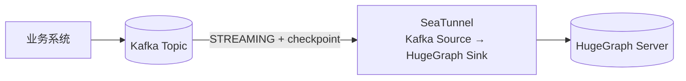
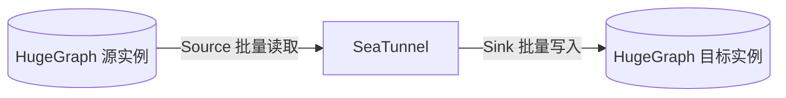

<!--
  TODO(apache/hugegraph-doc#464)：本文 SeaTunnel 官方文档链接暂指向 latest（无版本号）页面。
  HugeGraph Source Connector 尚未随正式版本发布，官网 latest 无对应页面，
  故 Source 文档链接暂指向 GitHub dev 分支文件。
  待 Source 随正式版本发布后，将链接切换为官网版本化地址，
  例如 https://seatunnel.apache.org/docs/2.3.14/connectors/source/HugeGraph/
-->

### 1 版本与兼容性

| 组件 | 版本要求 | 说明 |
|------|---------|------|
| Java | 11+ | HugeGraph Client 1.5.0+ 运行环境要求 |
| Apache SeaTunnel | 2.3.13+ | Sink 自 2.3.12 合入；2.3.13 起内置 HugeGraph Client 1.5.0 |
| HugeGraph Server | 1.5.0+ | 需与 Connector 内置 Client 版本匹配 |

> Source Connector 目前只在 SeaTunnel next（dev）分支，正式版还没带。要用就从源码编译，或等下一个 Release；next 分支内置的 HugeGraph Client 已升到 1.7.0，需搭配对应版本的 Server。

### 2 概述

[Apache SeaTunnel](https://seatunnel.apache.org/) 是开源数据集成平台，批处理、流式同步都支持，自带 100+ 连接器。HugeGraph 的 Connector-V2 已合入：Sink 负责写入（顶点/边的批量写入、更新、删除），Source 负责读取（批量读取、整图迁移）。


### 3 选型：SeaTunnel 还是 Loader

可以把 SeaTunnel 理解为 [Loader](/cn/docs/quickstart/toolchain/hugegraph-loader) + [Tools](/cn/docs/quickstart/toolchain/hugegraph-tools) 的合集。两者不冲突：Loader 只管 HugeGraph，开箱即用；SeaTunnel 面向所有数据系统。按场景选：

| 你的场景 | 推荐 | 理由 |
|---------|------|------|
| 一次性 / 定时把本地文件、HDFS、MySQL 等导入 HugeGraph | Loader | 免部署，映射文件即写即用 |
| 数据已在（或必须经过）Flink、Spark、Kafka 等大数据管道 | SeaTunnel | 复用现有管道，不引入第二套导入工具 |
| 实时流式导入、CDC 增量同步 | SeaTunnel | 原生流式作业 + checkpoint 断点恢复 |
| 导入时自动创建 Schema（PropertyKey / VertexLabel / EdgeLabel） | SeaTunnel | Sink 默认 `CREATE_SCHEMA_WHEN_NOT_EXIST` |
| 只维护 HugeGraph 一张图，规模可控、追求简单 | Loader | 工具链内闭环，无额外集群 |

选 SeaTunnel 要接受两点：部署一套 SeaTunnel 集群（或复用现有的），作业用通用 HOCON 配置，而不是 HugeGraph 映射文件。

### 4 快速开始

前置条件：HugeGraph Server 1.5.0+（[部署指南](/cn/docs/quickstart/hugegraph/hugegraph-server)）。

#### 4.1 部署 SeaTunnel

**Docker（推荐）**。拉取镜像，把作业配置所在目录挂载进容器提交，宿主机不用装 Java 环境：

```bash
docker pull apache/seatunnel:2.3.13

docker run --rm -it \
  -v /path/to/job:/config \
  apache/seatunnel:2.3.13 \
  ./bin/seatunnel.sh -e local -c /config/hugegraph-sync.conf
```

更多用法见官方 [Docker 部署文档](https://seatunnel.apache.org/docs/getting-started/docker/docker/)。

**Kubernetes**：生产集群用 Helm 部署，见官方 [K8s（Helm）部署文档](https://seatunnel.apache.org/docs/getting-started/kubernetes/helm/)。

**二进制包（参考）**：从 [下载页](https://seatunnel.apache.org/download/) 取安装包，解压后装插件、跑脚本。JVM 脚本方式仅作本地调试参考，生产优先 Docker / K8s：

```bash
sh bin/install-plugin.sh 2.3.13
sh bin/seatunnel.sh --config ./config/hugegraph-sync.conf -e local
```

部署细节以官方 [本地部署文档](https://seatunnel.apache.org/docs/getting-started/locally/deployment/) 为准。

#### 4.2 最小示例：CSV 文件 → person 顶点

准备一个无表头的 CSV（列顺序与 `schema.fields` 声明顺序一致），内容如下：

```csv
marko,29
vadas,27
josh,32
```

```hocon
env {
  job.mode = "BATCH"
}

source {
  LocalFile {
    path = "/data/person.csv"
    file_format_type = "csv"
    schema = {
      fields = {
        name = "string"
        age = "int"
      }
    }
  }
}

sink {
  HugeGraph {
    host = "127.0.0.1"
    port = 8080
    graph_name = "hugegraph"
    graph_space = "DEFAULT"
    # 以下为可选参数，默认值见第 6 节；认证开启时再填 username/password
    # protocol = "http"
    # username = "admin"
    # password = "admin"
    # schema_save_mode = CREATE_SCHEMA_WHEN_NOT_EXIST
    mappings = [
      {
        type = "VERTEX"
        label = "person"
        idStrategy = "PRIMARY_KEY"
        idFields = ["name"]
        properties = ["name", "age"]
      }
    ]
  }
}
```

一行 CSV 到图顶点的映射过程：

```text
┌───────────────── 输入行 (SeaTunnel Row) ─────────────────┐
│  name = "marko"        age = 29                          │
└──────────────────────────┬───────────────────────────────┘
                           │ mappings:
                           │   type = VERTEX, label = person
                           │   idStrategy = PRIMARY_KEY, idFields = [name]
                           ▼
                 ┌───────────────────────────────┐
                 │ HugeGraph 顶点                 │
                 │ id   = person:marko           │
                 │ label = person                │
                 │ props = { age: 29 }           │
                 └───────────────────────────────┘
```

#### 4.3 运行与验证

```bash
# 配置和 CSV 分别挂载进容器；路径换成你机器上的实际目录
docker run --rm -it \
  -v /path/to/job:/config \
  -v /path/to/data:/data \
  apache/seatunnel:2.3.13 \
  ./bin/seatunnel.sh -e local -c /config/hugegraph-sync.conf
```

运行后，在 Hubble 或 REST API 里执行这条 Gremlin 验证：

```groovy
g.V().hasLabel('person').valueMap()
```

> **Schema 说明**：`mappings` 模式下默认 `schema_save_mode = CREATE_SCHEMA_WHEN_NOT_EXIST`，写入前自动补建缺失的 PropertyKey / VertexLabel / EdgeLabel。要严格管控就自己先建 Schema，并设 `ERROR_WHEN_SCHEMA_NOT_EXIST`。

#### 4.4 写入边

关系行到边的映射同样通过 `mappings` 完成，用 `sourceConfig` / `targetConfig` 还原边的两个端点。

<details>
<summary>展开查看：关系 CSV → knows 边 完整配置</summary>

CSV（无表头）：

```csv
marko,vadas,2020
marko,josh,2021
```

```hocon
env {
  job.mode = "BATCH"
}

source {
  LocalFile {
    path = "/data/knows.csv"
    file_format_type = "csv"
    schema = {
      fields = {
        person1_name = "string"
        person2_name = "string"
        since = "int"
      }
    }
  }
}

sink {
  HugeGraph {
    host = "127.0.0.1"
    port = 8080
    graph_name = "hugegraph"
    graph_space = "DEFAULT"
    mappings = [
      {
        type = "EDGE"
        label = "knows"
        sourceConfig = {
          label = "person"
          idFields = ["person1_name"]
        }
        targetConfig = {
          label = "person"
          idFields = ["person2_name"]
        }
        properties = ["since"]
        fieldMapping = {
          person1_name = "name"
          person2_name = "name"
        }
      }
    ]
  }
}
```

</details>

```text
person1_name = "marko"   person2_name = "vadas"   since = 2020
        │                        │
        ▼                        ▼
  sourceConfig             targetConfig
  label = person           label = person
  idFields = [person1_name] idFields = [person2_name]
        └───────────┬────────────┘
                    ▼
      edge: person:marko -[knows]-> person:vadas
      properties = { since: 2020 }
```

> 边的端点 ID 策略从服务端已有的 VertexLabel 读取，`sourceConfig.idFields` / `targetConfig.idFields` 必须能拼出端点 ID。默认 `check_vertex = false`，顶点和边允许乱序写入，跑完图最终一致；设成 `true` 则服务端直接拒绝端点不存在的边。

### 5 常见场景

#### 5.1 Kafka 实时流导入



<details>
<summary>展开查看：Kafka → HugeGraph 流式作业配置</summary>

```hocon
env {
  job.mode = "STREAMING"
  checkpoint.interval = 10000
}

source {
  Kafka {
    bootstrap.servers = "localhost:9092"
    topics = "user-events"
    consumer.group = "hugegraph-import"
    format = json
    schema = {
      fields = {
        name = "string"
        age = "int"
      }
    }
  }
}

sink {
  HugeGraph {
    host = "127.0.0.1"
    port = 8080
    graph_name = "hugegraph"
    graph_space = "DEFAULT"
    mappings = [
      {
        type = "VERTEX"
        label = "person"
        idStrategy = "PRIMARY_KEY"
        idFields = ["name"]
        properties = ["name", "age"]
      }
    ]
  }
}
```

</details>

> 要点：`job.mode = "STREAMING"` 加 `checkpoint.interval`，任务就能断点恢复。Sink 是 at-least-once 语义，`PRIMARY_KEY` / `CUSTOMIZE_*` 这类可还原的 ID 重放只是幂等更新。Kafka 的 offset、分区、format 等参数见 [Kafka Source 官方文档](https://seatunnel.apache.org/docs/connectors/source/Kafka/)。

#### 5.2 在 Flink / Spark 上运行

作业默认跑在 SeaTunnel 自带的 Zeta 引擎上。已有 Flink / Spark 集群的话，同一份配置换对应的 starter 脚本提交即可，内容不用改。脚本用法和版本支持见官方 [Flink 引擎文档](https://seatunnel.apache.org/docs/engines/flink/) 与 [Spark 引擎文档](https://seatunnel.apache.org/docs/engines/spark/)。

#### 5.3 HugeGraph → HugeGraph 图迁移（Source Connector，next 分支）



<details>
<summary>展开查看：单图迁移（person 顶点）</summary>

```hocon
env {
  job.mode = "BATCH"
}

source {
  HugeGraph {
    host = "127.0.0.1"
    port = 8080
    graph_name = "hugegraph"
    graph_space = "DEFAULT"
    label = "person"
    label_type = "VERTEX"
    schema = {
      fields = {
        name = "string"
        age = "int"
      }
    }
  }
}

sink {
  HugeGraph {
    host = "127.0.0.2"
    port = 8080
    graph_name = "hugegraph"
    graph_space = "DEFAULT"
    mappings = [
      {
        type = "VERTEX"
        label = "person"
        idStrategy = "PRIMARY_KEY"
        idFields = ["name"]
        properties = ["name", "age"]
      }
    ]
  }
}
```

</details>

<details>
<summary>展开查看：批量迁移（A 实例 3 个图 → B 实例，图名不变）</summary>

一次作业迁一张图；省略 `label` 时读取该图全部顶点 label，边同理（`label_type = "EDGE"`），顶点和边分开跑。多张图用变量替换 + 循环逐个执行：

```hocon
env {
  job.mode = "BATCH"
}

source {
  HugeGraph {
    host = "graph-a:8080"
    port = 8080
    graph_name = "${graph}"
    graph_space = "DEFAULT"
    label_type = "VERTEX"
    # 不写 label：读取该图全部顶点 label；迁边时改成 "EDGE"
  }
}

sink {
  HugeGraph {
    host = "graph-b:8080"
    port = 8080
    graph_name = "${graph}"
    graph_space = "DEFAULT"
    # mappings 按目标图的 label 逐一列出，源、目标同名 label 一一对应
    mappings = [...]
  }
}
```

```bash
# 每个图跑两次：先顶点（VERTEX）、再边（EDGE），图名不变
for g in graph1 graph2 graph3; do
  docker run --rm -it -v /path/to/job:/config apache/seatunnel:2.3.13 \
    ./bin/seatunnel.sh -e local -c /config/hugegraph-migrate.conf -i graph=$g
done
```

`-i key=value` 会把配置里的 `${key}` 替换成对应值，用法见官方 [命令文档](https://seatunnel.apache.org/docs/engines/zeta/user-command/)。

</details>

> 克隆边时，Source 输出自带保留列 `~source_id` / `~target_id`，Sink 直接配 `sourceConfig.idFields = ["~source_id"]`、`targetConfig.idFields = ["~target_id"]` 就能复用，不用重新拼 ID。Source 还支持 `parallelism > 1` 分片并行，详见 [HugeGraph Source 文档](https://github.com/apache/seatunnel/blob/dev/docs/zh/connectors/source/HugeGraph.md)。

### 6 核心配置参数

常用参数如下，完整列表见 [官方文档](https://seatunnel.apache.org/docs/connectors/sink/HugeGraph/)：

| 参数 | 类型 | 必填 | 默认值 | 说明 |
|------|------|------|--------|------|
| `host` | String | 是 | - | HugeGraph Server 地址 |
| `port` | Integer | 是 | - | HugeGraph Server 端口 |
| `graph_name` | String | 是 | - | 图名称 |
| `mappings` | List | 是 | - | 顶点/边映射配置，每项一个 label |
| `graph_space` | String | 否 | `DEFAULT` | 图空间 |
| `protocol` | String | 否 | `http` | 服务协议，支持 `http` / `https` |
| `username` | String | 否 | - | 认证用户名（服务端开启认证时必填） |
| `password` | String | 否 | - | 认证密码（服务端开启认证时必填） |
| `schema_save_mode` | Enum | 否 | `CREATE_SCHEMA_WHEN_NOT_EXIST` | 缺失 Schema 时自动建；`ERROR_WHEN_SCHEMA_NOT_EXIST` 则报错 |
| `data_save_mode` | Enum | 否 | `APPEND_DATA` | `APPEND_DATA` 保留已有数据；`DROP_DATA` 仅清空本任务涉及的 label |
| `batch_size` | Integer | 否 | 500 | 单批写入前缓冲的记录数 |
| `batch_interval_ms` | Integer | 否 | 5000 | 刷新批次的最大等待时间（毫秒） |
| `check_vertex` | Boolean | 否 | false | 写边时校验端点是否存在，开启后拒绝孤儿边 |
| `max_retries` | Integer | 否 | 3 | 请求失败后的重试次数 |
| `retry_backoff_ms` | Integer | 否 | 5000 | 重试基础退避时间（毫秒），指数增长 |

mappings 每项的常用字段：`type`、`label`、`properties`、`idStrategy` / `idFields`（顶点）、`sourceConfig` / `targetConfig`（边）、`fieldMapping`、`ttl`、`updateStrategies`，详见 [官方文档](https://seatunnel.apache.org/docs/connectors/sink/HugeGraph/)。

### 参考文档

- [Apache SeaTunnel 官方网站](https://seatunnel.apache.org/)
- [HugeGraph Sink Connector 官方文档](https://seatunnel.apache.org/docs/connectors/sink/HugeGraph/)
- [HugeGraph Source Connector 文档（dev 分支）](https://github.com/apache/seatunnel/blob/dev/docs/zh/connectors/source/HugeGraph.md)
- [SeaTunnel Docker 部署](https://seatunnel.apache.org/docs/getting-started/docker/docker/)
- [SeaTunnel K8s（Helm）部署](https://seatunnel.apache.org/docs/getting-started/kubernetes/helm/)
- [SeaTunnel 本地部署](https://seatunnel.apache.org/docs/getting-started/locally/deployment/)
- [Apache SeaTunnel GitHub](https://github.com/apache/seatunnel)
- [HugeGraph GitHub](https://github.com/apache/hugegraph)
