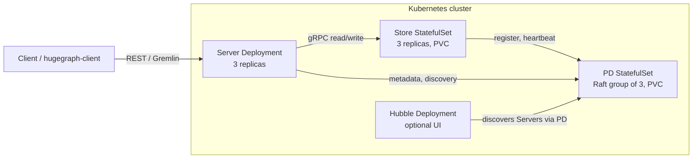

### 1 Overview

The Helm chart deploys a distributed HugeGraph cluster on Kubernetes: PD, Store, and Server, plus the optional
Hubble UI. It lives in the main repository under
[`helm/hugegraph`](https://github.com/apache/hugegraph/tree/master/helm/hugegraph).

| Component | Workload | Default replicas | Purpose |
|-----------|----------|------------------|---------|
| PD | StatefulSet + PVC | 3 | Placement driver: a Raft group tracking Stores and partitions |
| Store | StatefulSet + PVC | 3 | Graph data storage (HStore) |
| Server | Deployment | 3 | Gremlin and REST query layer |
| Hubble | Deployment | 0 (off) | Web UI, enabled with `hubble.enabled=true` |

A distributed HugeGraph cluster has a startup contract (no `init-store` on Server, every Server using PD for graph
metadata, Store waiting for a PD quorum, one PD REST secret shared by three readers). The chart encodes that
contract so operators do not have to; the details are in the
[chart README](https://github.com/apache/hugegraph/tree/master/helm/hugegraph#chart-details).
Day-2 work (NetworkPolicy details, disaster recovery, scaling, safe Store
rolls, running Hubble outside the cluster) is on the
[operations page](/docs/quickstart/hugegraph/hugegraph-helm-operations/).



Startup order is enforced by the chart, not by the operator: PD pods elect a leader first, each Store pod waits in
an init container until a majority of PD peers report ready, and Servers keep restarting their storage wait until
Stores have registered. A fresh install converges without manual steps.

### 2 Prerequisites

- Kubernetes 1.23 or later (the chart renders `autoscaling/v2` and `policy/v1`)
- Helm 3; the `--reset-then-reuse-values` flag mentioned under Upgrade needs Helm 3.14 or later
- Dynamic volume provisioning: a default StorageClass, or an explicit `storageClassName` for PD and Store
- Memory for nine JVMs in the default topology; see the resource note under Install

The chart requires component images that carry the PD readiness endpoint and PD REST authentication (both merged
for the release after 1.7.0). The default image tags already point at builds that include them; 1.7.0 images are
not supported.

### 3 Install

#### 3.1 Get the chart

The chart is not published to a chart repository yet, so install it from the source tree:

```bash
git clone https://github.com/apache/hugegraph.git
cd hugegraph
```

#### 3.2 Install with default values

First confirm `kubectl` points at the intended cluster and that it can provision volumes. PVCs stuck in `Pending`
for want of a StorageClass are the most common first-run failure:

```bash
kubectl config current-context
kubectl get storageclass
```

Then install:

```bash
helm install hugegraph ./helm/hugegraph --namespace hugegraph --create-namespace --wait --timeout 15m
```

`--wait` makes Helm block until every workload is ready, which for a distributed cluster is the signal that PD
elected a leader, Stores registered, and Servers came up; without it `helm install` returns as soon as the objects
are created. A fresh cluster normally converges in a few minutes; the 15 minute timeout leaves room for slow image
pulls.

Two defaults to know before going further:

- **No resources are set.** Every pod is BestEffort and each JVM sizes its heap against total node memory. That is
  fine on a single node; on a multi-node cluster the heaps oversubscribe the nodes and pods abort. Use
  `values-cluster.yaml` or set `resources` per component for anything beyond a laptop.
- **Image tags track `latest`** until the next HugeGraph release is published, with `pullPolicy: Always`. Pin tags
  or digests for production.

#### 3.3 Topology presets

The chart ships three values files:

| File | Topology | Intended use |
|------|----------|--------------|
| `values.yaml` | 3 PD + 3 Store + 3 Server | Default; preferred anti-affinity, auth on, Hubble off |
| `values-single.yaml` | 1 + 1 + 1 | Single-node development and CI; smaller PVCs |
| `values-cluster.yaml` | 3 + 3 + 3 | Production starting point: JVM heap and resource settings, PD/Store PodDisruptionBudgets, `required` anti-affinity, NetworkPolicy on |

```bash
helm install hugegraph ./helm/hugegraph --namespace hugegraph --create-namespace \
    -f helm/hugegraph/values-single.yaml --wait --timeout 15m
```

`values-cluster.yaml` is a starting point, not a capacity guarantee: recalculate resources for your graph size and
traffic. One of its numbers deserves a note: it requests 5Gi and limits at 8Gi of memory per Store, well above the
1Gi heap, because the Store's RocksDB caches live outside the JVM heap (a 4Gi limit OOM-killed Stores after about
1 GB of data). Scale both numbers with data size. The full parameter reference (every component, probe,
scheduling, and Secret knob) is kept in the
[chart README](https://github.com/apache/hugegraph/tree/master/helm/hugegraph#configuration).

#### 3.4 Verify the install

```bash
helm test hugegraph --namespace hugegraph
```

Read the generated admin password and call the API:

```bash
PASSWORD="$(kubectl get secret -n hugegraph hugegraph-admin -o jsonpath='{.data.password}' | base64 --decode)"
kubectl port-forward -n hugegraph svc/hugegraph-server 8080:8080
curl --user "admin:${PASSWORD}" http://127.0.0.1:8080/versions
```

The commands above assume the release is named `hugegraph`; with another name, substitute the release-prefixed
resource names (`kubectl get svc,secret -n <namespace>` lists them). The post-install notes printed by
`helm install` repeat these commands with the right names filled in.

### 4 Authentication and Secrets

Authentication is on by default and the chart manages three Secrets. Each credential resolves in the same order:
an `existingSecret` you created wins, then an inline value, then a random value generated at install time.

| Secret | Key | Used for | Bring your own with |
|--------|-----|----------|---------------------|
| `<release>-admin` | `password` | Server admin account, Hubble login | `server.auth.admin.existingSecret` |
| `<release>-auth-token` | `token_secret` | JWT signing key shared by all Server replicas | `server.auth.token.existingSecret` |
| `<release>-pd-auth` | `secret-key` | PD REST authentication, read by PD, Server, and Hubble | `pd.auth.existingSecret` |

To manage a credential yourself, create the Secret before installing and point the matching `existingSecret` value
at it; the chart never modifies a Secret it did not create. Value constraints: the admin password must not contain
newlines, carriage returns, or backslashes; the JWT key must be at least 32 bytes; the PD secret must be printable
ASCII. Invalid values are rejected at render time or by the startup wrapper, not silently truncated.

Chart-managed Secrets are kept on uninstall and reused by a later install under the same release name.

<details>
<summary>Rotation and caveats</summary>

- The admin password is applied only when the auth metadata is first created, so changing the Secret later does not
  rotate an existing cluster's password. Rotate it through the Server's auth API instead.
- Rotating the PD REST Secret rolls PD, Server, and Hubble together on the next `helm upgrade`, which keeps their
  copies in step. Template-only pipelines (`helm template`, GitOps renderers) cannot see live Secrets, so there the
  rotation-detecting annotation is inert.
- All three Secrets exist even if you only ever read one: the post-install notes print the exact `kubectl get
  secret` commands for the admin password and the PD secret.
</details>

### 5 Health checks and startup order

PD exposes two health endpoints, and the chart deliberately uses both:

- `/v1/health` answers 200 as soon as the REST listener is up. It never consults Raft, so it cannot see a lost
  quorum.
- `/v1/ready` answers 503 until the PD Raft group has a leader, so it reports quorum, not just a live process.

The chart puts PD **readiness** and the Store init-container wait on `/v1/ready`: a Store only starts once a
majority of PD peers are quorum members, and a PD that lost its leader drops out of Service endpoints until a
leader is back. PD **startup and liveness** derive from the replica count (`pd.livenessPath` overrides the
choice). With more than one PD they stay on `/v1/health` on purpose: a PD that merely lost its leader is still a
healthy Raft member, and restarting it would make the outage worse. A single PD is the exception and derives to
`/v1/ready`: it has no election to lose, and one that steps down for good, as after a failed Raft snapshot on a
full disk ([apache/hugegraph#3222](https://github.com/apache/hugegraph/issues/3222)), would answer `/v1/health`
forever while serving no writes; the kubelet restarts it instead.

Server startup gets a matching budget: the image would normally kill a Server still starting after 120 seconds, so
the chart derives `HG_SERVER_STARTUP_TIMEOUT_S` from the startup probe (450 seconds by default) and raises a lower
configured probe budget to that floor. Raise `server.probes.startup` if your storage takes longer to come up, and
the image budget follows.

### 6 Enable the Hubble UI

Hubble is off by default so API-only clusters stay lean. Enable it on a running release:

```bash
helm upgrade hugegraph ./helm/hugegraph --namespace hugegraph --reuse-values --set hubble.enabled=true
```

```bash
kubectl port-forward -n hugegraph svc/hugegraph-hubble 8088:8088
```

Open `http://127.0.0.1:8088` and log in as `admin` with the admin password from Section 3.4. Hubble discovers the
Servers through PD, so the cluster operations view works without extra wiring. Hubble serves plain HTTP: reach it
through a port-forward or an HTTPS-terminating Ingress, never directly from an untrusted network. Running Hubble
outside the cluster is possible but takes more wiring; see
[Reaching Hubble](https://github.com/apache/hugegraph/tree/master/helm/hugegraph#reaching-hubble-pick-one-path) in
the chart README.

### 7 Upgrade

```bash
helm upgrade hugegraph ./helm/hugegraph --namespace hugegraph --reuse-values
```

`--reuse-values` keeps the release's existing overrides; without it the upgrade rebuilds the release from chart
defaults. Any upgrade that changes a Pod template rolls that workload once. Points worth planning around:

- **The first upgrade after a fresh install rolls PD, Server, and Hubble once**, when the Secret-tracking
  annotations first observe the install-created Secrets. Store is untouched.
- **Store rolling updates advance on a listener check, not on shard recovery**, so the controller can replace the
  next Store while the previous one is still rejoining its shard groups. For a production image roll, set
  `store.updateStrategy.type=OnDelete` and replace Store pods one at a time. `Up` in PD is not the between-pods
  check: PD marks a Store `Up` at registration, before it restores partitions, and a stopped Store stays `Up`
  until a 300 s keep-alive expires. Wait for the replaced Pod to be `Ready`, then confirm every shard group
  reports its full shard count with one leader; the full procedure is on the
  [operations page](/docs/quickstart/hugegraph/hugegraph-helm-operations/). PD restarts are one pod at a time
  either way, and `pd.updateStrategy.type=OnDelete` gives the same manual control for maintenance windows.
- **PVC sizes cannot be changed by upgrade**: Kubernetes forbids changing StatefulSet `volumeClaimTemplates`, so an
  upgrade with a new `storage.size` is rejected in full. The chart README documents the resize procedure for
  StorageClasses that support volume expansion.

Scaling Server up and down is a values change (`server.replicas`, or `server.hpa`). Scaling **PD or Store down is
not**: Raft and shard membership are persisted, deleting pods does not reconfigure them, and a 3-to-1 PD shrink
permanently loses quorum. The chart rejects an upgrade whose replica count is below the live StatefulSet; the
manual drain-then-scale procedure is in the chart README under
[Scaling](https://github.com/apache/hugegraph/tree/master/helm/hugegraph#scaling).

### 8 Uninstall

```bash
helm uninstall hugegraph --namespace hugegraph
```

Two kinds of state survive on purpose. PersistentVolumeClaims created by the StatefulSets are kept (Kubernetes
behavior); delete them explicitly once the data is no longer needed. The chart-managed Secrets are also kept, so a
later install under the same release name comes back with the same credentials.

### 9 Limitations

- `networkPolicy.enabled` renders one NetworkPolicy per component that admits only the release's own traffic; it
  is off by default and on in `values-cluster.yaml`. It matters because the chart disables the PD Raft IP
  allowlist in-cluster (pod IPs change; the allowlist resolves peers once at boot and then blocks them), so the
  policies are what restricts the raft and gRPC ports. They need a network plugin that enforces NetworkPolicy
  (Calico, Cilium, kind v0.25 or later, k3s), and every outside client, the Ingress controller included, must be
  listed in `networkPolicy.<component>.extraIngress` or the render fails. Details are on the
  [operations page](/docs/quickstart/hugegraph/hugegraph-helm-operations/).
- Image tags track `latest` until the next HugeGraph release publishes versioned images; pin tags or digests for
  anything long-lived.
- After creating a graph, other Server replicas can lag for a short window before they serve queries for it, so a
  query routed to a not-yet-converged replica can fail with an error such as `Could not rebind [g]`. Retry with
  backoff, or use sticky routing for create-then-query flows; cluster-wide graph readiness is tracked in
  [#3137](https://github.com/apache/hugegraph/issues/3137).
- Store recovery is operator-triggered on current builds: re-replication after Store loss, leader balancing, and
  partition rebalancing run only when called through PD's REST API. A Store whose volume is lost can be recovered
  in place only on images carrying
  [apache/hugegraph#3234](https://github.com/apache/hugegraph/pull/3234) (merged 2026-09-24, in no release yet);
  on earlier images, keep a Store's PVC when replacing its Pod. The Disaster Recovery section of the
  [operations page](/docs/quickstart/hugegraph/hugegraph-helm-operations/) is the runbook.
- No TLS termination inside the cluster, no backup tooling, no Operator, and no bundled monitoring stack.

### 10 Troubleshooting

| Symptom | First check |
|---------|-------------|
| Store pods stuck in `Init:0/1` | PD is not ready: `kubectl logs <store-pod> -c wait-for-pd`, then the PD pods |
| PVCs stay `Pending` | No default StorageClass, or the provisioner is down: `kubectl get sc` |
| Pods OOM killed or restarting on multi-node | No resources set, JVM heaps sized to node memory: use `values-cluster.yaml` |
| Query fails right after creating a graph | Replica convergence window: see Limitations above |

Longer walkthroughs for each case are in the
[chart README](https://github.com/apache/hugegraph/tree/master/helm/hugegraph#troubleshooting).
