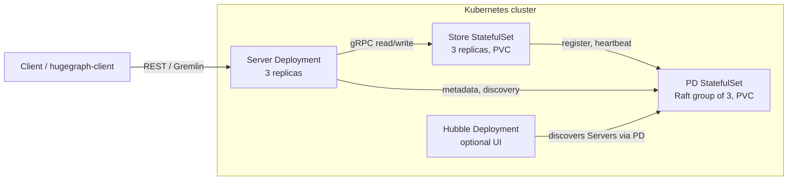

### 1 Overview

The Helm chart deploys a distributed HugeGraph cluster on Kubernetes: PD, Store, and Server, plus the optional
Hubble UI. It lives in the main repository under
[`helm/hugegraph`](https://github.com/apache/hugegraph/tree/master/helm/hugegraph).

| Component | Workload | Default replicas | Purpose |
|-----------|----------|------------------|---------|
| PD | StatefulSet + PVC | 3 | Placement driver: a Raft group tracking Stores and partitions |
| Store | StatefulSet + PVC | 3 | Graph data storage (HStore) |
| Server | Deployment | 3 | Gremlin and REST query layer |
| Hubble | Deployment | 0 (off) | Web UI, enabled with `hubble.enabled=true` |

A distributed HugeGraph cluster has a startup contract (no `init-store` on Server, every Server using PD for graph
metadata, Store waiting for a PD quorum, one PD REST secret shared by three readers). The chart encodes that
contract so operators do not have to; the details are in the
[chart README](https://github.com/apache/hugegraph/tree/master/helm/hugegraph#chart-details).
Day-2 work (NetworkPolicy details, disaster recovery, scaling, safe Store
rolls, running Hubble outside the cluster) is on the
[operations page](/docs/quickstart/hugegraph/hugegraph-helm-operations/).


```mermaid
flowchart LR
    subgraph Kubernetes cluster
        PD[PD StatefulSet<br>Raft group of 3, PVC]
        Store[Store StatefulSet<br>3 replicas, PVC] -->|register, heartbeat| PD
        Server[Server Deployment<br>3 replicas] -->|metadata, discovery| PD
        Server -->|gRPC read/write| Store
        Hubble[Hubble Deployment<br>optional UI] -->|discovers Servers via PD| PD
    end
    Client[Client / hugegraph-client] -->|REST / Gremlin| Server
```

Startup order is enforced by the chart, not by the operator: PD pods elect a leader first, each Store pod waits in
an init container until a majority of PD peers report ready, and Servers keep restarting their storage wait until
Stores have registered. A fresh install converges without manual steps.

### 2 Prerequisites

- Kubernetes 1.23 or later (the chart renders `autoscaling/v2` and `policy/v1`)
- Helm 3; the `--reset-then-reuse-values` flag mentioned under Upgrade needs Helm 3.14 or later
- Dynamic volume provisioning: a default StorageClass, or an explicit `storageClassName` for PD and Store
- Memory for nine JVMs in the default topology; see the resource note under Install

The chart requires component images that carry the PD readiness endpoint and PD REST authentication (both merged
for the release after 1.7.0). The default image tags already point at builds that include them; 1.7.0 images are
not supported.

### 3 Install

#### 3.1 Get the chart

The chart is not published to a chart repository yet, so install it from the source tree:

```bash
git clone https://github.com/apache/hugegraph.git
cd hugegraph
```

#### 3.2 Install with default values

First confirm `kubectl` points at the intended cluster and that it can provision volumes. PVCs stuck in `Pending`
for want of a StorageClass are the most common first-run failure:

```bash
kubectl config current-context
kubectl get storageclass
```

Then install:

```bash
helm install hugegraph ./helm/hugegraph --namespace hugegraph --create-namespace --wait --timeout 15m
```

`--wait` waits for Kubernetes readiness probes, not application workflows. A fresh cluster normally converges in
a few minutes; the 15-minute timeout leaves room for slow image pulls. Verify graph queries after installation.
Without `--wait`, Helm returns as soon as the objects are created.

Two defaults to know before going further:

- **No resources are set.** Every pod is BestEffort, and each JVM sets its maximum heap to half of the memory it
  sees free on the node at start (up to a per-component ceiling), so the JVMs on one node can together claim more
  memory than the node has. That holds for `values-single.yaml` on one node as well. Set `resources` per component on every install, the single-node
  preset included; `values-cluster.yaml` sets them for a multi-node cluster.
- **Image tags track `latest`** until the next HugeGraph release is published, with `pullPolicy: Always`. Pin tags
  or digests for production.

#### 3.3 Topology presets

The chart ships three values files:

| File | Topology | Intended use |
|------|----------|--------------|
| `values.yaml` | 3 PD + 3 Store + 3 Server | Default; preferred anti-affinity, auth on, Hubble off |
| `values-single.yaml` | 1 + 1 + 1 | Single-node development and CI; smaller PVCs |
| `values-cluster.yaml` | 3 + 3 + 3 | Production starting point: JVM heap and resource settings, a Server PodDisruptionBudget, `required` anti-affinity, NetworkPolicy on, Store `OnDelete` updates |

```bash
helm install hugegraph ./helm/hugegraph --namespace hugegraph --create-namespace \
    -f helm/hugegraph/values-single.yaml --wait --timeout 15m
```

`values-cluster.yaml` is a starting point, not a capacity guarantee: recalculate resources for your graph size and
traffic. One of its numbers deserves a note: it requests 5Gi and limits at 8Gi of memory per Store, well above the
1Gi heap, because the Store's RocksDB caches live outside the JVM heap (a 4Gi limit OOM-killed Stores after about
1 GB of data). Scale both numbers with data size. The full parameter reference (every component, probe,
scheduling, and Secret knob) is kept in the
[chart README](https://github.com/apache/hugegraph/tree/master/helm/hugegraph#configuration).

#### 3.4 Verify the install

```bash
helm test hugegraph --namespace hugegraph --logs --timeout 5m
```

The test first calls `/versions` and `/graphs` through the Server Service. It then resolves the headless Service
`hugegraph-server-headless` and sends an authenticated Gremlin query bound to the `DEFAULT-hugegraph` graph to
each Server Pod it lists, and it requires at least `server.replicas` Pods (`server.hpa.minReplicas` with HPA on).
The headless Service lists only Ready Pods, the same Pods the Server Service routes to, so a Pod that is not Ready
is not queried. A failing Pod is retried every 5 seconds for up to 150 seconds, so a short PD election is not
reported as a broken Pod; after that the test fails and prints each failing Pod IP with its HTTP status. This is
the check that catches a Server that passes readiness and serves REST while every Gremlin call on it fails (see
Limitations). Large HPA fleets may need `helm test --timeout` above the 5-minute default.

The hook verifies Server Gremlin, not Hubble login. With Hubble enabled, also verify a fresh login and graph query
after installation or recovery; `/actuator/health` alone does not establish backend connectivity.

To call the API, start a port-forward in one terminal; it runs in the foreground until you stop it:

```bash
kubectl port-forward -n hugegraph svc/hugegraph-server 8080:8080
```

Then, in a second terminal, read the generated admin password and call the API:

```bash
PASSWORD="$(kubectl get secret -n hugegraph hugegraph-admin -o jsonpath='{.data.password}' | base64 --decode)"
curl --user "admin:${PASSWORD}" http://127.0.0.1:8080/versions
```

The commands above assume the release is named `hugegraph`; with another name, substitute the release-prefixed
resource names (`kubectl get svc,secret -n <namespace>` lists them). The post-install notes printed by
`helm install` repeat these commands with the right names filled in.

### 4 Authentication and Secrets

Authentication is on by default and the chart manages three Secrets. Each credential resolves in the same order:
an `existingSecret` you created wins, then an inline value, then a random value generated at install time.

| Secret | Key | Used for | Bring your own with |
|--------|-----|----------|---------------------|
| `<release>-admin` | `password` | Server admin account, Hubble login | `server.auth.admin.existingSecret` |
| `<release>-auth-token` | `token_secret` | JWT signing key shared by all Server replicas | `server.auth.token.existingSecret` |
| `<release>-pd-auth` | `secret-key` | PD REST authentication, read by PD, Server, and Hubble | `pd.auth.existingSecret` |

To manage a credential yourself, create the Secret before installing and point the matching `existingSecret` value
at it; the chart never modifies a Secret it did not create. Value constraints: the admin password must be printable
ASCII with no spaces, colons, or backslashes (the image stores a space with a backslash before it, and the Server splits
Basic-auth credentials on every colon, so either would leave the account unable to log in with the Secret value); the
JWT key must be at least 32 bytes; the PD secret must be printable ASCII with no backslashes and no leading or trailing
space. Invalid inline values are rejected at render time, and an `existingSecret` by the startup wrapper when the Pod
starts, not silently truncated.

Chart-managed Secrets are kept on uninstall and reused by a later install under the same release name.

<details>
<summary>Rotation and caveats</summary>

- The admin password is applied only when the auth metadata is first created, so changing the Secret later does not
  rotate an existing cluster's password. Rotate it through the Server's auth API instead.
- Rotating a credential rolls the Pods that read it once, on the next `helm upgrade`: PD, Server, and Hubble together
  for the PD REST Secret, which keeps their copies in step, and Server for the admin password or JWT key.
- Template-only pipelines (`helm template`, Argo CD, Flux in template mode) cannot see live Secrets, so a
  chart-generated credential gets a new value on every render: each sync changes the Secret, rolls the Pods that read
  it, and leaves the admin account created at first start out of step with the Secret. For such a pipeline, create the
  three Secrets first and set the `existingSecret` values; see
  [Template-only pipelines](https://github.com/apache/hugegraph/tree/master/helm/hugegraph#template-only-pipelines-gitops)
  in the chart README.
- All three Secrets exist even if you only ever read one: the post-install notes print the exact `kubectl get
  secret` commands for the admin password and the PD secret.
</details>

### 5 Health checks and startup order

PD exposes two health endpoints, and the chart deliberately uses both:

- `/v1/health` answers 200 as soon as the REST listener is up. It never consults Raft, so it cannot see a lost
  quorum.
- `/v1/ready` answers 503 until the PD Raft group has a leader, so it reports quorum, not just a live process.

The chart puts PD **readiness** and the Store init-container wait on `/v1/ready`: a Store only starts once a
majority of PD peers are quorum members, and a PD that lost its leader drops out of Service endpoints until a
leader is back. PD **startup and liveness** derive from the replica count (`pd.livenessPath` overrides the
choice). With more than one PD they stay on `/v1/health` on purpose: a PD that merely lost its leader is still a
healthy Raft member, and restarting it would make the outage worse. A single PD is the exception and derives to
`/v1/ready`: it has no election to lose, and one that steps down for good, as after a failed Raft snapshot on a
full disk ([apache/hugegraph#3222](https://github.com/apache/hugegraph/issues/3222)), would answer `/v1/health`
forever while serving no writes; the kubelet restarts it instead.

Server startup gets a budget of at least 450 seconds, enough for the 300-second storage wait the image entrypoint
runs before the start command, plus process startup. The chart counts the guaranteed probe time as
`(failureThreshold - 1) * periodSeconds`, because the kubelet may run the first probe as soon as the container
starts, and raises a lower configured `failureThreshold` to that floor (91 at the default 5-second period, the
value `values.yaml` ships). The image would kill a Server still starting after 120 seconds, so the chart also sets
`HG_SERVER_STARTUP_TIMEOUT_S` to the guaranteed probe time minus the 300-second storage wait: 150 seconds by
default, never less than the image's 120. The start command and the probe then give up together. Raise
`server.probes.startup` if your storage takes longer to come up, and the timeout follows; the variable is
chart-managed, so change the probe rather than setting it in `server.extraEnv`.

### 6 Enable the Hubble UI

Hubble is off by default so API-only clusters stay lean. Enable it on a running release:

```bash
helm upgrade hugegraph ./helm/hugegraph --namespace hugegraph --reuse-values \
    --set hubble.enabled=true --wait --timeout 15m
```

```bash
kubectl port-forward -n hugegraph svc/hugegraph-hubble 8088:8088
```

Open `http://127.0.0.1:8088` and log in as `admin` with the admin password from Section 3.4. Hubble discovers the
Servers through PD, so the cluster operations view works without extra wiring. Hubble serves plain HTTP: reach it
through a port-forward or an HTTPS-terminating Ingress, never directly from an untrusted network; a NodePort or
LoadBalancer Hubble Service is refused unless `hubble.service.allowInsecureExposure=true` acknowledges it. Running Hubble
outside the cluster is possible but takes more wiring; see
[Reaching Hubble](https://github.com/apache/hugegraph/tree/master/helm/hugegraph#reaching-hubble-pick-one-path) in
the chart README.

### 7 Upgrade

```bash
helm upgrade hugegraph ./helm/hugegraph --namespace hugegraph --reuse-values
```

`--reuse-values` keeps the release's existing overrides; without it the upgrade rebuilds the release from chart
defaults. It also keeps the old values as the complete base, so a release created by an earlier chart revision does
not pick up new defaults such as the hardened `securityContext`; pass your own values with `-f`, or use
`--reset-then-reuse-values`, to adopt them. Any upgrade that changes a Pod template rolls that workload once.
Points worth planning around:

- **A no-change upgrade rolls nothing.** The Secret-tracking annotations hash each credential's value, or the live
  `resourceVersion` of an `existingSecret`, so a Pod rolls only when a credential it reads changes. An upgrade that
  does roll PD and Server together, such as a PD REST Secret rotation or an image change on both, can leave a Server
  without its Gremlin binding (see Limitations). Treat `pd.auth` rotation as coordinated maintenance, not an
  unattended routine change: run `helm test --logs` afterwards and recover affected replicas as documented on the
  [operations page](/docs/quickstart/hugegraph/hugegraph-helm-operations/#10-when-gremlin-fails-with-could-not-rebind).
  A rollback that rolls both components needs the same verification.
- **Store rolling updates advance on a listener check, not on shard recovery**, so the controller can replace the
  next Store while the previous one is still rejoining its shard groups. `values-cluster.yaml` therefore sets
  `store.updateStrategy.type=OnDelete`; `values.yaml` and `values-single.yaml` keep `RollingUpdate`, so set it
  yourself on any other production values. Under `OnDelete` an upgrade updates the StatefulSet but replaces no
  Store Pod, and you delete Store Pods one at a time. `OnDelete` only stops automatic advancement: deleting Pods
  without checking between them carries the same risk. `Up` in PD is not that check: PD marks a Store `Up` at
  registration, before it restores partitions, and a stopped Store stays `Up` until a 300 s keep-alive expires.
  No endpoint on current images reports that a Store has finished restoring its partitions
  ([apache/hugegraph#3229](https://github.com/apache/hugegraph/issues/3229)), so the check is indirect. Wait for
  the replaced Pod to be `Ready`, then confirm every shard group reports its full shard count with one
  leader; the full procedure is on the
  [operations page](/docs/quickstart/hugegraph/hugegraph-helm-operations/#6-rolling-store-images-safely).
- **The controller never rolls more than one PD or Store Pod at a time.** The chart leaves
  `updateStrategy.rollingUpdate.maxUnavailable` unset and accepts only the integer `1` there: a larger number or
  a percentage fails the render, because it would let the controller take down two members of a three-member
  Raft group or shard at once, and a PodDisruptionBudget does not limit controller rollouts. For PD maintenance
  windows, `pd.updateStrategy.type=OnDelete` gives the same manual control as for Store.
- **PVC sizes cannot be changed by upgrade**: Kubernetes forbids changing StatefulSet `volumeClaimTemplates`, so an
  upgrade with a new `storage.size` is rejected in full. The chart README documents the resize procedure for
  StorageClasses that support volume expansion.
- **Some values are fixed once the release is initialized.** `nameOverride`, `fullnameOverride`, the PD and Store
  raft ports, and the storage settings are install-time identity: the chart refuses an override or raft port change
  against the live StatefulSets, and Kubernetes refuses the storage change. `server.auth.admin.*` and the partition
  shard counts apply at bootstrap only, so an initialized cluster ignores a new value. The chart README sorts the
  values by
  [lifecycle](https://github.com/apache/hugegraph/tree/master/helm/hugegraph#settings-by-lifecycle).
- **`helm rollback` runs none of the chart's guards.** A rollback, including the automatic one after a failed
  `--atomic` upgrade, reapplies an earlier stored manifest without rendering the chart, so a rollback across a PD or
  Store replica change scales the StatefulSet straight to the old count and can drop PD below quorum. Rollback across
  a membership or identity change is unsupported: return to an earlier chart or image with a forward upgrade that
  keeps the current topology values, and keep `--atomic` off for upgrades that change replicas. The chart README
  covers the checks to run after any
  [rollback](https://github.com/apache/hugegraph/tree/master/helm/hugegraph#rollback).

Scaling Server up and down is a values change (`server.replicas`, or `server.hpa`). Changing the **PD count in
either direction, or shrinking Store, is not**: Raft and shard membership are persisted and Pods alone do not
reconfigure them, so a 3-to-1 PD shrink permanently loses quorum and new PD Pods do not join the voting
configuration. The chart reads the live StatefulSet and rejects an upgrade that changes the PD count or
lowers the Store count; the manual procedures are on the
[operations page](/docs/quickstart/hugegraph/hugegraph-helm-operations/#8-scaling).

### 8 Uninstall

```bash
helm uninstall hugegraph --namespace hugegraph
```

Two kinds of state survive on purpose. PersistentVolumeClaims created by the StatefulSets are kept (Kubernetes
behavior); delete them explicitly once the data is no longer needed. The chart-managed Secrets are also kept, so a
later install under the same release name comes back with the same credentials.

### 9 Limitations

- `networkPolicy.enabled` renders one NetworkPolicy per component that admits only the release's own traffic; it
  is off by default and on in `values-cluster.yaml`. It matters because the chart disables the PD Raft IP
  allowlist in-cluster (pod IPs change; the allowlist resolves peers once at boot and then blocks them), so the
  policies are what restricts the raft and gRPC ports. They need a network plugin that enforces NetworkPolicy
  (Calico, Cilium, kind v0.25 or later, k3s), and every outside client, the Ingress controller included, must be
  listed in `networkPolicy.<component>.extraIngress` or the render fails. Details are on the
  [operations page](/docs/quickstart/hugegraph/hugegraph-helm-operations/).
- Image tags track `latest` until the next HugeGraph release publishes versioned images; pin tags or digests for
  anything long-lived.
- After creating a graph, other Server replicas can lag for a short window before they serve queries for it, so a
  query routed to a not-yet-converged replica can fail with an error such as `Could not rebind [g]`. Retry with
  backoff, or use sticky routing for create-then-query flows; cluster-wide graph readiness is tracked in
  [#3137](https://github.com/apache/hugegraph/issues/3137).
- A Server that starts while PD is unreachable, as during a PD roll, can come up without its Gremlin binding for
  the life of the Pod: it passes readiness and serves REST while every Gremlin request on it fails with
  `Could not rebind [graph]` ([apache/hugegraph#3228](https://github.com/apache/hugegraph/issues/3228)). The
  readiness probe calls `/versions` and cannot see this. `helm test` queries Gremlin on every Ready Server Pod and
  prints the IP of a Pod in this state; delete that Pod, and its replacement binds once PD is stable. See
  [When Gremlin fails with "Could not rebind"](/docs/quickstart/hugegraph/hugegraph-helm-operations/#10-when-gremlin-fails-with-could-not-rebind).
- A PD that cannot open its RocksDB store at startup, for example because another process still holds the
  store's `LOCK` file, neither retries nor exits: it logs `Failed to open RocksDB` once and keeps running, with
  `/v1/ready` answering 503 and `STATE_UNINITIALIZED` while `/v1/health` answers 200. This was observed on PD
  processes outside Kubernetes ([apache/hugegraph#3226](https://github.com/apache/hugegraph/issues/3226)). Under
  the chart's probes such a Pod is not Ready and leaves the Service endpoints. With more than one PD, startup and
  liveness use `/v1/health`, so the kubelet does not restart it; with a single PD they use `/v1/ready`, so the
  kubelet restarts the container. How this state arises on Kubernetes, and whether restarting or deleting the Pod
  clears it, has not been tested. Deleting the `LOCK` files is not a fix: they protect the store from a second
  process that may still be running.
- Store recovery is operator-triggered on current builds: re-replication after Store loss, leader balancing, and
  partition rebalancing run only when called through PD's REST API. A Store whose volume is lost can be recovered
  in place only on images carrying
  [apache/hugegraph#3234](https://github.com/apache/hugegraph/pull/3234) (merged 2026-09-24, in no release yet);
  on earlier images, keep a Store's PVC when replacing its Pod. The Disaster Recovery section of the
  [operations page](/docs/quickstart/hugegraph/hugegraph-helm-operations/) is the runbook.
- The Server and Hubble serve plain HTTP, and PD gRPC has no authentication. A NodePort or LoadBalancer Service for
  any of them is refused unless the matching `pd.service.allowInsecureExposure`, `server.service.allowInsecureExposure`,
  or `hubble.service.allowInsecureExposure` is set, and a Server or Hubble Ingress without `tls` is refused unless its
  `allowPlainHttp` is set. Prefer a port-forward or an HTTPS-terminating Ingress, and restrict who can reach an
  exposed Service first.
- No TLS termination inside the cluster, no backup tooling, no Operator, and no bundled monitoring stack.

### 10 Troubleshooting

| Symptom | First check |
|---------|-------------|
| Store pods stuck in `Init:0/1` | PD is not ready: `kubectl logs <store-pod> -c wait-for-pd`, then the PD pods |
| PVCs stay `Pending` | No default StorageClass, or the provisioner is down: `kubectl get sc` |
| Pods OOM killed or restarting | No resources set, JVM heaps sized to node memory: set `resources` (see Install) |
| Query fails right after creating a graph | Replica convergence window: see Limitations above |
| `helm test` prints `Gremlin failed on <Pod IP>` | That Server Pod lost its Gremlin binding: delete it (see Limitations above) |
| A PD Pod stays not Ready and its `/v1/ready` reports `STATE_UNINITIALIZED` | Its RocksDB store may not have opened: look for `Failed to open RocksDB` in its log (see Limitations above) |

Longer walkthroughs for most of these cases are in the
[chart README](https://github.com/apache/hugegraph/tree/master/helm/hugegraph#troubleshooting).
